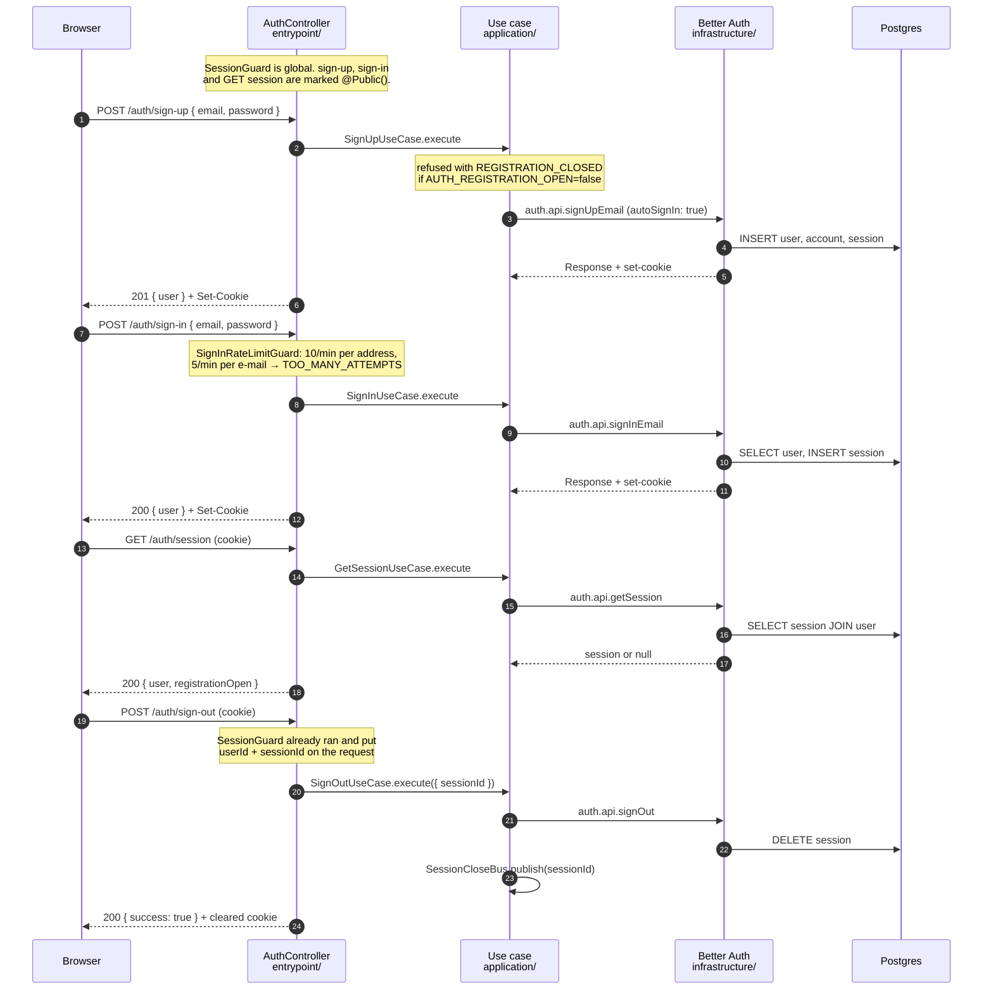
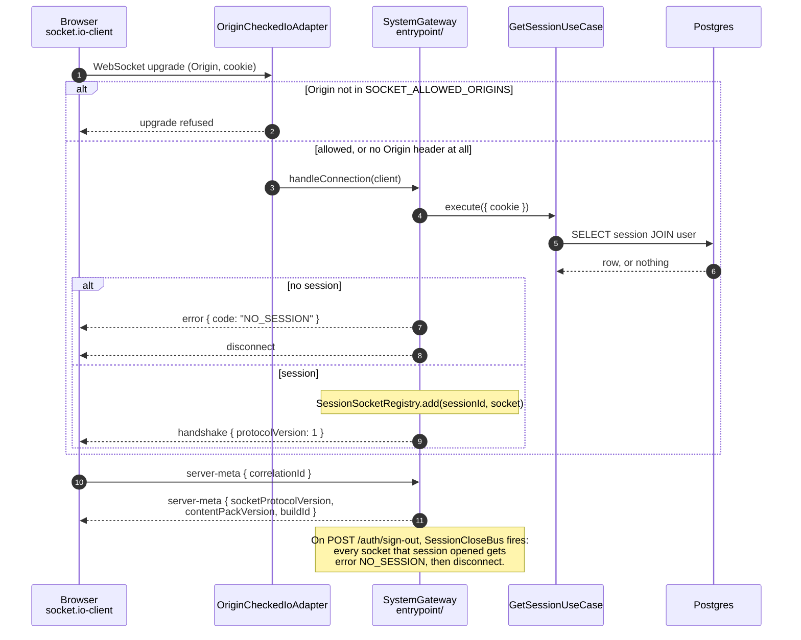

# gomide_idle

**Tormented Path** — a browser idle RPG. You pick a hunt, your character clears
the waves and the boss on its own, and the thing you actually play is the rule
list that decides how it fights. The alpha runs its first season, **Mortal Ways**.

This file is the operating guide: how to run the repo, and how the parts that
exist today actually work. The *rules* live in `docs/` and are linked, never
copied.

## The docs

| File | What it is |
| --- | --- |
| [`alpha.md`](alpha.md) | **The closed alpha, one page.** The spec plus the four decisions the build rests on. Start here for the game. |
| [`vision.md`](vision.md) | The parking lot. Wanted but not in the alpha. Nothing here is committed to. |
| [`docs/`](docs/) | The planning system: roadmap items, task breakdowns, explorations, and one rule doc per area. |
| [`project.yml`](project.yml) | The manifest. Names the planning folders and maps each area to its rule doc. |
| [`docs/superseded.md`](docs/superseded.md) | Docs that were deleted, and why, so they are not re-proposed. |

The rule that keeps these apart: **`alpha.md` is what gets built,
[`docs/roadmap/`](docs/roadmap/) is in what order, `vision.md` is what doesn't
(yet).** An idea moves between them by a deliberate edit, never by drifting.

---

## Get it running

**Prerequisites.** Node **24 or newer** (`pnpm-workspace.yaml` sets
`engineStrict`, so an older Node fails at install with the reason named), pnpm
**11.17.0** (pinned in `package.json`'s `packageManager`), and Docker — Postgres
runs in a container and nothing else does.

Run these in order from the repo root:

| # | Command | What it does |
| --- | --- | --- |
| 1 | `make install` | Installs every workspace package with pnpm. |
| 2 | `make env` | Copies `.env.example` to `.env` if you have no `.env` yet. The defaults are complete — nothing needs editing to run locally. |
| 3 | `make db-up` | Starts the Postgres 17.11 container and waits for it to be healthy. |
| 4 | `make migrate` | Applies the committed migrations. Creates `server_meta` (seeded with one row) and the four Better Auth tables. |
| 5 | `make dev-all` | Starts Postgres (again, harmlessly) and runs the API and the web dev server together. |

Two things are then live:

- **<http://localhost:5173>** — the web app (Vite). **Use this one.** It proxies
  `/api/*` and `/socket.io` through to the API, which is what keeps the
  everything-on-one-origin rule true in development
  ([`apps/web/vite.config.ts`](apps/web/vite.config.ts)).
- **<http://localhost:3000>** — the API on its own. Useful for `curl`; the
  browser app is not served from here.

Sign up at <http://localhost:5173/sign-up>, and you land on `/characters`, which
is deliberately empty — the character list is a later roadmap item.

**Before you commit:** `make check`. It runs lint, format check, typecheck,
dependency boundaries and every test, then regenerates all generated files and
fails if any of them changed. That last step is the one that catches a
hand-edited generated file.

### If something is wrong

| Symptom | Fix |
| --- | --- |
| `make migrate` fails to connect | `make db-up` first, or the container is not healthy yet. |
| `server_meta has no row` at runtime | The seed migration never ran. `make migrate`. |
| Database in a weird state | `make db-reset` — drops the volume, recreates it, re-migrates. Destroys local data. |
| Sign-in works but every request after it is a 401 | You are talking to `:3000` directly instead of `:5173`. The cookie is same-origin. |

---

## The commands worth knowing

The `Makefile` is the interface. `make help` prints all of them; these are the
ones you will reach for.

| Target | What it does |
| --- | --- |
| **Setup** | |
| `make install` | Install every workspace dependency. |
| `make env` | Create `.env` from `.env.example` if absent. |
| **Develop** | |
| `make dev-all` | Postgres + the API + the web dev server. |
| `make dev-api` | Postgres + the API alone, in watch mode. |
| `make dev-web` | The Vite dev server alone. |
| **Database** | |
| `make db-up` / `make db-down` | Start / stop the Postgres container (`db-down` keeps the data volume). |
| `make db-reset` | Drop the volume, recreate, re-migrate. |
| `make db-studio` | Open drizzle-kit studio against the local database — a browser table browser. |
| `make migrate` | Apply committed migrations. |
| `make migrate-generate` | Diff the schema files and write a new migration. |
| **Generate** | |
| `make generate` | Regenerate every generated file: the OpenAPI document, the theme, the route tree, the Orval client. |
| `make api-auth-schema` | Regenerate the Better Auth Drizzle schema from the library's own table metadata. |
| **Test** | |
| `make test` | Every package. Jest for the API and the libs, Vitest for the web. |
| `make test-unit` / `make test-integration` | The API's two Jest projects. The integration one starts a real Postgres via testcontainers. |
| **Gates** | |
| `make check` | The full CI gate, locally. Run before committing. |
| `make lint` / `make fmt` / `make typecheck` | The individual pieces. |
| `make depcruise` | Check the layer and folder boundaries (dependency-cruiser). |
| **Planning** | |
| `make roadmap-sync` | Recompute every derived status and table under `docs/`. |
| `make roadmap-check` | Fail on a stale table, a bad dependency, or a missing `project.yml` path. |

---

## The folder map

### Top level

| Path | Responsible for | Rules |
| --- | --- | --- |
| [`apps/api/`](apps/api/) | The NestJS server: HTTP routes, the socket gateway, Postgres, auth. | [`architecture-api.md`](docs/architecture-api.md), [`stack-api.md`](docs/stack-api.md) |
| [`apps/web/`](apps/web/) | The React + TanStack Router browser app. | [`architecture-web.md`](docs/architecture-web.md), [`stack-web.md`](docs/stack-web.md) |
| [`libs/`](libs/) | Code both sides share, or that must depend on nothing. | below |
| [`docs/`](docs/) | Every rule, roadmap item, task breakdown and exploration. | [`project.yml`](project.yml) |
| [`scripts/`](scripts/) | The roadmap sync engine (`roadmap-sync.mjs`) — the only thing that writes the generated tables in `docs/`. | — |
| [`.claude/`](.claude/) | Agent configuration: the planning skills, and a hook that refuses a docs edit made without a session branch. | — |
| [`Makefile`](Makefile) | Every command a developer needs. If it is not here, it is not the supported way. | — |
| [`docker-compose.yml`](docker-compose.yml) | Postgres, and nothing else. The app runs from source on the host. | — |
| [`.env.example`](.env.example) | Every variable [`config/env.ts`](apps/api/src/config/env.ts) declares, with no real values. Copy it, do not edit it. | — |

### `libs/` — the three shared packages

| Package | Responsible for | Why it is its own package |
| --- | --- | --- |
| [`libs/contracts/`](libs/contracts/src/) | Every payload shape: the Zod request/response schemas, the socket message schemas, the error-code vocabulary (`ERROR_CODES`), and `SOCKET_PROTOCOL_VERSION`. | One source feeds server-side validation, the OpenAPI document, and the generated web client — so the three cannot drift. |
| [`libs/content/`](libs/content/src/) | The JSON content pack and its validator. **Empty today**; it fills with the first game system. | The content is data, not server code, so it must not live behind a NestJS import. |
| [`libs/simulation/`](libs/simulation/src/) | The deterministic combat code. **Empty today**; the Automatic combat roadmap item fills it. | It depends on *nothing* — that is what makes its determinism enforced by the build rather than remembered by a person. |

### `apps/api/src/` — cross-cutting folders

These sit outside the modules because they belong to no single feature.

| Path | Responsible for |
| --- | --- |
| [`config/`](apps/api/src/config/) | `env.ts` — the one Zod schema for every environment variable, validated at start-up. A bad value stops the process with the field named. |
| [`logging/`](apps/api/src/logging/) | One pino instance, one log shape, one correlation id. `AppLogger` is injected (never constructed), NestJS's own boot output is routed through the same instance, and passwords / tokens / e-mails / session ids are scrubbed recursively before a line is written. |
| [`errors/`](apps/api/src/errors/) | One exception filter for both transports. HTTP gets `{ statusCode, code, message }`; a socket gets the same minus the status, plus the correlation id. `CodedException` is how feature code throws an expected error. |
| [`observability/`](apps/api/src/observability/) | The `@nestjs/observe` agent's wiring. Off unless credentialed — see [Watching it run](#watching-it-run). |
| [`realtime/`](apps/api/src/realtime/) | `OriginCheckedIoAdapter` (the socket `Origin` check) and `SessionCloseBus` (the channel by which a deleted session closes its live sockets). |
| [`http/`](apps/api/src/http/) | `@Public()` — the one decorator that opts a route out of the global session guard. |
| [`modules/`](apps/api/src/modules/) | The feature modules: `auth`, `system`, and the placeholder `player`, `character`, `hunt`. Each has the same four layers. |

### One module, four layers

Every module under `apps/api/src/modules/` has the same shape. Here is
`modules/system`, which owns the `server_meta` read path:

```
modules/system/
  entrypoint/       server-meta.controller.ts, system.gateway.ts
  application/      get-server-meta.use-case.ts, get-server-meta.dao.port.ts
  domain/           (empty — this read has no rules)
  infrastructure/   database/dao/get-server-meta.dao.ts, database/schema/
```

Four words each, because they matter here:

- **entrypoint/** — *takes the request*. A controller (HTTP) or a gateway
  (sockets). A **guard** is a yes/no check that runs before a handler
  (`SessionGuard`, `SignInRateLimitGuard`); a **gateway** is a controller for
  socket messages. An entrypoint decides nothing: it parses the body shape, calls
  one use case, and maps the result back.
- **application/** — *holds the use case*. A **use case** is one operation with
  one `execute` method and one typed input, so the same operation is reachable
  from HTTP and from a socket. It also declares its **ports** — an interface
  naming what it needs from the outside (`GetServerMetaDaoPort`), so it never
  names an implementation.
- **domain/** — *holds the rules*. Pure TypeScript. No NestJS, no Drizzle, no
  Socket.IO, no schema library. Empty in both real modules today, because neither
  has a rule yet.
- **infrastructure/** — *talks to the outside*. The Drizzle **DAO** — a read
  object with no aggregate behind it — and the Better Auth adapter. The ORM's
  inferred row type never leaves this layer.

**The arrows point inward.** `entrypoint/` → `application/` → `domain/`.
`infrastructure/` → `application/` (it implements the port) → `domain/`. The two
outer folders never import each other, and `domain/` imports nothing above it.

This is not a convention people remember — `make depcruise` fails the build on a
violation, and an `import type` counts.

### `apps/web/src/`

| Path | Responsible for |
| --- | --- |
| [`routes/`](apps/web/src/routes/) | TanStack Router file routes. `_authed.tsx` is the one auth guard; `index.tsx` is sign-in; `-shell/` and `-auth/` are colocated pieces the router ignores (the leading `-`). |
| [`features/`](apps/web/src/features/) | One folder per feature, holding its hooks. `features/session/` is the only place the session is read, outside `routes/`. |
| [`lib/`](apps/web/src/lib/) | The generated API client and the one fetch mutator that wraps it (base path, cookies, error shape, the single 401 handler), plus i18n and styles. |
| [`transport/`](apps/web/src/transport/) | The **only** file that imports `socket.io-client`, and the protocol guard built on it. |
| [`ui/`](apps/web/src/ui/) | Copied-in primitives — `Button`, `Input`. Knows nothing about any feature. |
| [`renderer/`](apps/web/src/renderer/) | Pixi and the renderer port. **Empty today.** No React and no game rule ever goes in here. |

**Three generated files — never hand-edit.** `make check` reverts them and fails.

| File | Regenerated by |
| --- | --- |
| `apps/web/src/routeTree.gen.ts` | `make generate` (TanStack Router CLI) |
| `apps/web/src/theme.ts` and `theme.css` | `make generate`, from [`docs/design-tokens.json`](docs/design-tokens.json) |
| `apps/web/src/lib/api/generated/` | `make generate`, from `apps/api/openapi.json` via Orval |
| `apps/api/src/modules/auth/infrastructure/database/schema/auth.schema.ts` | `make api-auth-schema` |

---

## How a request flows

Five HTTP routes exist today. Written as the API sees them; from the browser they
all carry the `/api` prefix the dev proxy strips.

| Route | Public? | What it does |
| --- | --- | --- |
| `POST /auth/sign-up` | yes | Creates an account and signs it straight in. |
| `POST /auth/sign-in` | yes | Exchanges e-mail + password for a session cookie. Rate-limited. |
| `POST /auth/sign-out` | no | Deletes this session's row and closes its sockets. |
| `GET /auth/session` | yes | Who am I, and is registration open. `null` user when signed out — never a 401. |
| `GET /server-meta` | yes | The socket protocol version, the content-pack version, and the running build id. |

"Public" means marked `@Public()`. Everything else goes through `SessionGuard`,
which is registered globally — so a guard cannot be forgotten on next week's
controller.

### Auth



**The session is a row in Postgres, named by a cookie.** Nothing is held in
JavaScript, so there is no token to leak, no interceptor and no refresh logic. It
lasts 30 days and slides: once a session is a day old, the next authenticated
request extends it back to the full 30.

**Sign-out deletes exactly one row** — the one this cookie names. Another device
stays signed in. The publish on `SessionCloseBus` is what makes the deletion
reach the sockets that session opened, immediately rather than on their next
message.

**Better Auth's own error string never leaves the API.** The controller
translates it into one `code` from the shared vocabulary — `EMAIL_TAKEN`,
`INVALID_CREDENTIALS` — and anything unmapped becomes a plain 500. The web
renders from the code and never shows the server's message.

Rules: [`auth.md`](docs/auth.md).

### Server meta

```mermaid
sequenceDiagram
    autonumber
    participant B as Browser
    participant C as ServerMetaController<br/>entrypoint/
    participant U as GetServerMetaUseCase<br/>application/
    participant D as GetServerMetaDao<br/>infrastructure/
    participant P as Postgres

    B->>C: GET /server-meta
    C->>U: execute({})
    U->>D: getServerMeta()  (through the port)
    D->>P: SELECT socket_protocol_version,<br/>content_pack_version, build_id<br/>FROM server_meta
    P-->>D: the one row
    D-->>U: ServerMetaRowType
    Note over U: build id: env.BUILD_ID wins;<br/>the seeded column is only the fallback
    U-->>C: { socketProtocolVersion, contentPackVersion, buildId }
    C-->>B: 200
```

This is the whole read path in miniature, and the reason it exists: it proves
Postgres → DAO → port → use case → controller → rendered screen works end to end,
on a table with one row and no rules.

**The build id names which build answered.** A build id fixed at migration time
is stale on the next deploy, so the running API reports `BUILD_ID` from its
environment (a git sha in CI, `dev` locally) and falls back to the seeded column
only when that was left at its default. The web app shows it in the footer, which
is how you tell which build a bug report came from.

### Sockets



**The connection opens as soon as the app loads**, before any screen decides it
wants one — the web's protocol guard connects, reads the `handshake` frame, and
compares the version. The `server-meta` message is the same use case the HTTP
route calls, reached over the other transport.

---

## The socket layer

Four things about it are not obvious from the diagram.

**1. The handshake is authenticated exactly the way HTTP is.** The same
server-side session row, read from the same cookie, through the same
`GetSessionUseCase`. There is no socket token and no second auth path. A
handshake with no session gets a declared `NO_SESSION` **error frame** and *then*
a disconnect — not a bare close, because a bare close is indistinguishable from a
network drop and the client would retry forever.

**2. `Origin` is checked by the adapter, not by CORS.** CORS does not govern a
WebSocket upgrade. `OriginCheckedIoAdapter` checks the handshake's `Origin`
against `SOCKET_ALLOWED_ORIGINS` (comma-separated; the Vite dev origin in
development) and refuses at the upgrade. This is why `@WebSocketGateway()` in
`system.gateway.ts` carries **no** `cors` option — it used to say
`{ origin: true }`, which reflected back whatever origin asked, which is not a
check.

A request with no `Origin` header at all — a native client, a same-origin call —
is allowed through.

**3. `SOCKET_PROTOCOL_VERSION` is how a stale client refuses to play.** It is a
single integer, declared in
[`libs/contracts/src/protocol.ts`](libs/contracts/src/protocol.ts), hard-coded
again in [`apps/web/src/lib/protocol.ts`](apps/web/src/lib/protocol.ts), and
seeded into `server_meta`. Bump it only on a breaking change to the wire format.

A client with an old bundle has an old constant. It reads the server's number
from the `handshake` frame, sees a mismatch, and replaces the entire page with
the out-of-date screen. That is a refusal, not a degraded mode — rendering
nonsense from a protocol you do not speak is worse than saying so.

**4. A bad socket message is an error, not a disconnection.** The same
`AllExceptionsFilter` serves both transports, so a socket error frame carries the
**same `code`** an HTTP error would — read from the same `ERROR_CODES`
vocabulary — and the connection stays open. The frame is
`{ correlationId, code, message, children? }`: the HTTP body minus its status
code, plus the client's own correlation id echoed back.

The one case that *does* close the connection is a deleted session, and it takes
two objects to do it. `SessionCloseBus` is an in-process channel; the auth module
publishes a session id to it on sign-out and the system module's gateway
subscribes. `SessionSocketRegistry` is the session-id → sockets map the gateway
keeps. They exist as two pieces because the auth module and the system module
must not import each other. The registry is keyed by **session** id, not account
id, so signing out on your phone does not close the socket on your laptop.

Both are in-memory, and correct only while the API is one process. A second
process needs a shared channel first — recorded as a known gap in
[`auth.md`](docs/auth.md).

---

## Watching it run

### The observability dashboard

**What it is.** [`@nestjs/observe`](https://www.observe.nestjs.com/) is NestJS's
own APM agent. It hooks Nest's request lifecycle through the `instrument`
bootstrap option rather than patching the HTTP server, collects traces, runtime
metrics and errors, and ships them from a detached worker thread so the request
path is untouched. Its hosted collector has a dashboard at
<https://www.observe.nestjs.com/>.

**It is wired and deliberately silent.**
[`apps/api/src/observability/observability.ts`](apps/api/src/observability/observability.ts)
imports the package on every boot, but returns an empty wiring unless **both**
credentials are present. With them absent the module is never imported and no
`instrument` hook is set, so no worker starts and nothing is sent anywhere.
Development and CI leave them unset on purpose.

| Variable | Default | What it is |
| --- | --- | --- |
| `OBSERVE_APP_KEY` | *empty* | Sent as `x-api-key` on every ingest request. |
| `OBSERVE_APP_SECRET` | *empty* | Sent as `x-api-secret`. Shown once when issued; not retrievable afterwards. |
| `OBSERVE_SERVICE_ID` | `gomide-api` | Names this service in the dashboard. |
| `OBSERVE_ENDPOINT` | *empty* → the package's default, `https://observe-api.nestjs.com` | The collector's base URL. Set it to point at a self-hosted or local collector. |

**Logs do not go through it.** `forwardLogs: false` is set on purpose. Log lines
are pino's job. Locally they go to the API process's **stdout** — the terminal
running `make dev-api` or `make dev-all` — as one JSON object per line, with
`timestamp`, `level`, `module`, `message` and `correlationId` at the top and
everything else under `context`. Nothing writes a log file. `LOG_LEVEL` in `.env`
controls the volume.

**To turn it on:**

1. Sign up at <https://www.observe.nestjs.com/> and create a service. The
   dashboard issues the app key and the app secret together. The package's own
   docs say it is free up to 300,000 events a month.
2. Copy the secret immediately — it is displayed once, and a lost one has to be
   reissued as a new pair.
3. Put both in `.env`, next to the `OBSERVE_SERVICE_ID` that is already there.
   Never in `.env.example`, and never in a commit.
4. Restart the API. `make dev-api`.

**How you know it worked.** Load <http://localhost:5173>, sign in, and reload a
couple of times. The agent flushes on a 5-second interval, so wait about ten
seconds, then open the dashboard and look for the `gomide-api` service. Traces
for `GET /server-meta` and `POST /auth/sign-in` should be there. If the service
stays empty, the credentials are wrong: the collector answers `401` and drops
the batch silently.

**Honest limits of this section.** The dashboard's own documentation page
(`observe.nestjs.com/dashboard/documentation`) returns 404 to an anonymous
request and the landing page carries no setup detail, so everything above comes
from the installed package's README and its `ObserveOptions` type
(`node_modules/@nestjs/observe`), which are the versions this repo actually runs.
Signing-up screens, plan limits and the dashboard's exact layout have not been
seen and are not described here.

**Not wired yet**, and each would be a code change:

- `serviceVersion` is never set, though `BUILD_ID` is right there. Traces cannot
  be attributed to a build.
- `OBSERVE_SERVICE_ID` is one fixed string. The package suggests a per-instance
  value (hostname, container id) once more than one instance runs.
- `sourceContext` defaults to **on**, which ships fragments of application source
  alongside captured errors. Nothing in this repo turns it off. Decide that
  before the credentials go in.

### Better Auth

**Where it lives.** Every `better-auth` import is inside
[`apps/api/src/modules/auth/`](apps/api/src/modules/auth/) — one folder, so an
upgrade or a swap is not a grep.

| File | What it holds |
| --- | --- |
| [`infrastructure/auth.options.ts`](apps/api/src/modules/auth/infrastructure/auth.options.ts) | The options, shared by the runtime instance and the schema generator so there is only one copy. |
| [`infrastructure/auth.instance.ts`](apps/api/src/modules/auth/infrastructure/auth.instance.ts) | The running instance, over the Drizzle adapter. |
| [`infrastructure/auth.config.ts`](apps/api/src/modules/auth/infrastructure/auth.config.ts) | CLI-only. Nothing in the running app imports it. |

**What is configured:** e-mail and password only, passwords bounded at 8–128
characters, sign-up signs you straight in, e-mail verification off, sessions 30
days sliding, and **no mail sender of any kind**. That last one is not an
omission — with no sender, password reset and e-mail verification are
*unreachable* rather than half-built. `telemetry: { enabled: false }` turns off
Better Auth's own usage reporting.

**The schema is generated, not written.** `make api-auth-schema` reads Better
Auth's table metadata and writes
`modules/auth/infrastructure/database/schema/auth.schema.ts`. drizzle-kit then
diffs that file like any other (`make migrate-generate`, then `make migrate`).
`make check` regenerates it and fails on drift — a hand edit is reverted.

Four tables:

| Table | Holds |
| --- | --- |
| `user` | One row per account: id, name, e-mail, `email_verified` (always false here). |
| `session` | One row per signed-in device. Expiry, token, IP, user agent. Deleting a row is how a session is revoked. |
| `account` | The credential. For e-mail sign-in this is where the password hash lives; it exists in this shape because it is also where a social provider's tokens would go. |
| `verification` | Generated, and **permanently empty** while there is no mail sender. It fills itself the day verification or reset is switched on. |

**To look at them:** `make db-studio`. It opens drizzle-kit studio in a browser
against the local database.

**The hosted console: not connected, and connecting it is a code change.**
Better Auth's documentation describes a hosted dashboard at `dash.better-auth.com`
that connects to a self-hosted instance through a `dash()` plugin from
`@better-auth/infra`, authenticated with an API key
(`BETTER_AUTH_API_KEY`). Once connected it offers user management, session
monitoring and revocation, sign-up/sign-in analytics, and audit logs. Their
pricing page lists a $0 Starter tier with one dashboard seat.

This project has neither the plugin nor a key, so **the console cannot see it
today**. Adding the plugin means a new dependency and an edit to `auth.options.ts`
— outside what this pass was allowed to change, and a decision worth making
deliberately: it means an outbound connection from a server that currently makes
none. Note also that `telemetry: { enabled: false }` is a separate thing (Better
Auth's anonymous usage stats) and is not what gates the console.

**How you know it worked.** `make db-studio`, then sign up at
<http://localhost:5173/sign-up>. A row appears in `user`, a matching one in
`account`, and one in `session`. Sign out, refresh studio, and the `session` row
is gone — that deletion is the whole session model in one observation.

---

## Where to look next

- **What is being built, and in what order** — [`docs/roadmap/`](docs/roadmap/).
  One numbered doc per committed item; the number is a permanent ID. The tables
  are generated — edit the doc, not the table, then `make roadmap-sync`.
- **How the current item is sliced** — [`docs/tasks/`](docs/tasks/), one file per
  shippable slice, open only while an item is in progress.
- **Ideas still being researched** — [`docs/explorations/`](docs/explorations/).
  [`01-how-baiak-idle-works.md`](docs/explorations/01-how-baiak-idle-works.md) is
  a teardown of a shipped, commercial-scale game in this exact genre, and is the
  most useful document in the repo.
- **Ideas that were rejected** — [`docs/ditched/`](docs/ditched/), kept so they
  are not re-proposed.
- **The rules**, one doc per area, mapped in [`project.yml`](project.yml):

  | Area | Doc |
  | --- | --- |
  | Back-end | [`docs/architecture-api.md`](docs/architecture-api.md) |
  | Front-end | [`docs/architecture-web.md`](docs/architecture-web.md) |
  | API stack | [`docs/stack-api.md`](docs/stack-api.md) |
  | Web stack | [`docs/stack-web.md`](docs/stack-web.md) |
  | Auth | [`docs/auth.md`](docs/auth.md) |
  | Design | [`docs/design.md`](docs/design.md) |
  | Naming | [`docs/naming.md`](docs/naming.md) |

- **What the user needs and functional requirements are** —
  [`docs/requirements.md`](docs/requirements.md). Rule docs and roadmap items
  cite it by `UN.x` / `FR.x` throughout.
- **Reference material, not a spec** —
  [`docs/research/`](docs/research/). Written before most of this; parts describe
  a different design.

Run `make roadmap-check` after touching anything under `docs/`. It fails on a
stale table, a bad dependency, or a path named in `project.yml` that does not
exist.
