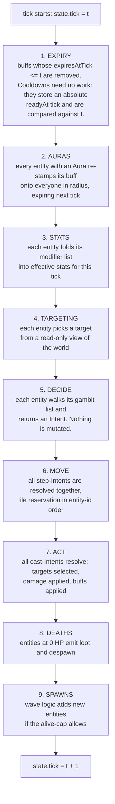
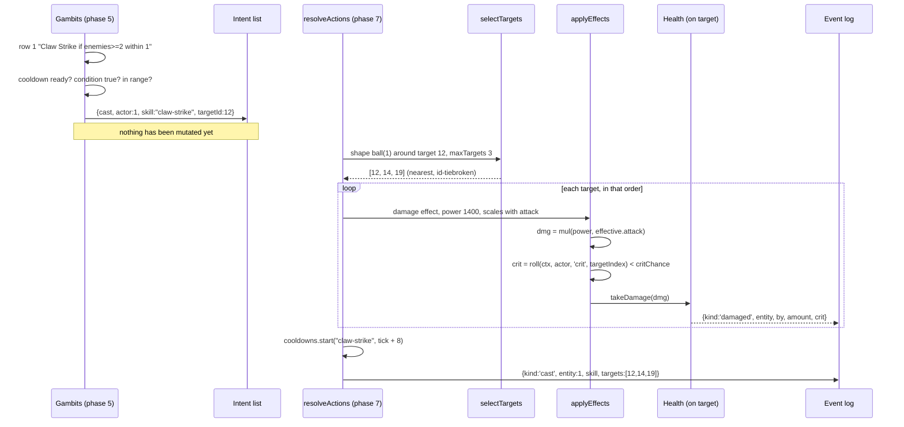

# Component-based game architecture — a guide from zero

Researched 2026-08-22. Written for someone who has never built a game and knows
backend TypeScript well. Every game term is defined the first time it is used.

> **Amended 2026-08-22 by [`explorations/02-domain-model.md`](../explorations/02-domain-model.md).**
> This guide assumes the game's own state is what gets written to the database —
> the shape almost every engine tutorial assumes. That is not this project's
> design. Nothing about a fight is ever persisted: the character is *projected*
> into components when a run starts, mutated freely, and thrown away
> (`architecture-api.md` rules 18 and 24). Two places say otherwise and carry
> in-place corrections: §6 and §9.2. Everything else in this guide stands.

The pattern under study is **component-based composition in the Unity / Godot
sense**: an entity owns a bag of components, and each component carries both its
own data and its own behaviour. ECS is not in the main body; it gets a fair
hearing in §11.

---

## 1. The words you need

Read this once. Everything after it uses these words without stopping to explain.

**Entity.** One thing in the game world that has state and does things. Your
character is an entity. Each monster is an entity. A dropped item on the floor
could be an entity. A damage number floating above a head is not — that is a
rendering artefact.

**Tick.** One step of simulated time. Not one frame of animation — one step of
the *rules*. Your server runs at some fixed rate, say 10 ticks per second, and
every tick advances the world by exactly 100 ms of game time. Ticks are the
simulation's clock. Nothing in the simulation ever asks the operating system what
time it is; it asks what tick it is.

**Game loop.** The loop that runs ticks. In a normal game it is `while (running) {
readInput(); update(); render(); }` racing the display. In your game there is no
display in the loop and no input to poll: it is `for (let i = 0; i < n; i++)
runTick(state)`, which is why ten hours of absence is just a bigger `n`.

**Update.** The verb for "advance one tick". Engines name the per-frame callback
`Update` (Unity) or `_process` (Godot). In this document `update` always means
"do this entity's or this component's part of one tick".

**Spawn.** Create an entity and put it in the world. **Despawn** is the reverse.
A monster wave spawning is five monsters being created and placed on tiles.

**System.** A function that runs over many entities and does one job — all the
movement, all the damage. The word comes from ECS, but the idea is older and you
will use it: in this guide the equivalent is called a **phase**.

**Scene graph.** A tree of entities where a child's position is expressed
relative to its parent — move the ship, the crew on deck move with it. Godot's
node tree is a scene graph. You have an arena of independent things on a flat
grid, so you need no scene graph at all. It is defined here only so that when a
tutorial assumes one, you know to skip that part.

**Data-oriented.** Designing around how data is laid out in memory and how it is
iterated, rather than around which real-world nouns exist. It is the philosophy
under ECS. It matters when you have a hundred thousand entities at 60 Hz. It does
not matter at twenty.

**Component.** A named, reusable piece of an entity that owns some state and the
rules that operate on that state. `Health` owns current and maximum HP and knows
how to take damage. That is the whole pattern; the rest of this document is why
it is shaped that way and how not to get it wrong.

**Composition.** Building a thing by giving it parts, instead of by declaring it a
kind of some other thing. "This monster *has* health, a position and an aura"
instead of "this monster *is a* flying fire monster".

**Buff.** A temporary modification to an entity — +20% attack for 30 seconds.
**Aura** — a buff that is continuously projected onto everything within a radius
for as long as the source keeps projecting it. **Cooldown** — the number of ticks
a skill must wait before it can be used again.

---

## 2. The problem this pattern exists to solve

Nobody invented components because composition is elegant. They invented them
because inheritance hierarchies for game entities collapse, reliably, at about
the same point in every project. You need to see the collapse to trust the fix.

### 2.1 The version that looks fine

You start your idle RPG. There are monsters. Monsters have HP and a tile
position, and each tick they step toward their target and attack it.

```ts
abstract class Monster {
  hp = 100;
  x = 0;
  y = 0;
  target: Monster | null = null;

  update(): void {
    this.stepTowardTarget();
    this.attack();
  }

  stepTowardTarget(): void { /* one tile toward this.target */ }
  attack(): void { /* deal damage to this.target */ }
}

class Rat extends Monster {}
class Wolf extends Monster { constructor() { super(); this.hp = 180; } }
```

This is fine. It is fine for about a week.

### 2.2 The first crack

A fire monster burns whatever it hits. That is new behaviour, so it is a new
subclass.

```ts
class FireMonster extends Monster {
  attack(): void {
    super.attack();
    this.applyBurn(this.target);
  }
  applyBurn(t: Monster | null): void { /* ... */ }
}
```

Then a flying monster, which ignores the rule that two entities cannot share a
tile, because it is above them.

```ts
class FlyingMonster extends Monster {
  stepTowardTarget(): void { /* move without reserving a tile */ }
}
```

Now the designer — you, next Tuesday — wants a **flying fire monster**.

TypeScript has single inheritance. You cannot extend both. You pick one and
copy-paste the other:

```ts
class FlyingFireMonster extends FireMonster {
  stepTowardTarget(): void { /* the flying code, pasted */ }
}
```

That paste is the crack. There are now two copies of the flying rule. When you
fix a bug in one, you will not remember the other.

### 2.3 The collapse

Keep going for a month of content. Flying, fire, ice, aura-projecting,
immobile-boss, splits-on-death, ranged. Seven independent traits.

```
                         Monster
                        /   |   \
                 Fire    Ice    Flying
                /   \      |      |  \
         FireFlying  FireAura  IceFlying ...
             |
      FireFlyingAura
             |
   FireFlyingAuraImmobile          ...and so on
```

Look at the shape: every new trait does not add one class, it *doubles* the
classes needed to cover all combinations. Seven independent traits is 128
possible monsters and you need a class for each combination you actually ship.

Four specific failures, each of which you will hit:

**1. Combinatorial explosion.** Above. The class count grows as 2ⁿ in the number
of traits while the content you actually want grows linearly.

**2. Refused bequest.** `FlyingMonster` inherits `reserveTile()` from `Monster`
and must actively *not* use it. A subclass that overrides a parent method to do
nothing is a signal that the parent gave it something it never wanted. Now every
tile-reservation change has to consider "what about the classes that opted out?"

**3. The god base class.** Your player character also has HP, a position, buffs
and skills. It is not a monster — it has an inventory and loot pickup and a
gambit list. So you hoist the shared parts up into `Entity`, and `Monster` and
`Player` extend it. Then bosses need loot tables, so loot moves up. Then some
monsters need gambit lists too, so gambits move up. Six months later `Entity` has
forty fields and every entity carries all of them, most as `null`. You have a god
class with subclasses that are only tags.

**4. Content is a code change.** This is the one that actually kills your project,
because your design says content must be data. `FlyingFireMonster` is a *class*.
Adding a monster means writing TypeScript, compiling, and deploying. You wanted
to add a row to a JSON file.

### 2.4 The same content, composed

Here is the fix, in the smallest form that shows the difference. Nothing is a
subclass of anything. A monster is an entity with parts.

```ts
const rat = makeEntity([
  new Position(4, 7),
  new Health(100),
  new Melee(12),
]);

const fireRat = makeEntity([
  new Position(4, 7),
  new Health(100),
  new Melee(12),
  new OnHitBurn(3),          // <- one part added
]);

const flyingFireRat = makeEntity([
  new Position(4, 7),
  new Health(100),
  new Melee(12),
  new OnHitBurn(3),
  new Flying(),              // <- another part added
]);
```

Look at what did *not* happen. `flyingFireRat` needed no new class. `Flying` was
written once and is now available to every entity forever, including the boss and
including the player's bear form. Seven traits is seven components and any of the
128 combinations is a list of names.

And because it is a list of names, it can be a JSON file:

```json
{
  "id": "flying-fire-rat",
  "components": {
    "position": {},
    "health": { "max": 100 },
    "melee":  { "power": 12 },
    "onHitBurn": { "stacks": 3 },
    "flying": {}
  }
}
```

New monster: a content edit. New *dimension* — something no component expresses
yet, like "reflects a percentage of damage back" — is a new component, which is a
code change. That is exactly the line your design already drew.

That is the whole argument. The rest of this document is how to build it without
creating a different mess.

---

## 3. Anatomy: what an entity actually is

An entity is an identity plus a bag of components. It has almost no behaviour of
its own.

```
        Entity #7  (kind: monster, template: "dire-bear")
        ┌──────────────────────────────────────────────┐
        │ id: 7                                        │
        │ components:                                  │
        │   ┌────────────────────────────────────────┐ │
        │   │ Position   { x: 12, y: 9 }             │ │
        │   ├────────────────────────────────────────┤ │
        │   │ Health     { current: 8400, max: 9000 }│ │
        │   ├────────────────────────────────────────┤ │
        │   │ Stats      { base: {...}, mods: [...] }│ │
        │   ├────────────────────────────────────────┤ │
        │   │ Skillbook  { ["claw-strike","roar"] }  │ │
        │   ├────────────────────────────────────────┤ │
        │   │ Cooldowns  { "claw-strike": 3 }        │ │
        │   ├────────────────────────────────────────┤ │
        │   │ Buffs      { [ {id,src,expiresAt} ] }  │ │
        │   ├────────────────────────────────────────┤ │
        │   │ Aura       { buffId:"bear-presence",   │ │
        │   │              radius: 3 }               │ │
        │   └────────────────────────────────────────┘ │
        └──────────────────────────────────────────────┘
```

Look at three things in that box. First, the entity itself holds only an id and
the bag — no HP field, no position field. Second, every component is a small
noun with its own fields. Third, `Aura` is present on this entity and absent on a
rat; presence *is* the trait.

In TypeScript, type the bag so that `entity.components.health` is `Health |
undefined` and a typo does not compile:

```ts
export interface ComponentMap {
  position:  Position;
  health:    Health;
  stats:     Stats;
  skillbook: Skillbook;
  cooldowns: Cooldowns;
  gambits:   Gambits;
  buffs:     Buffs;
  aura:      Aura;
  form:      Form;
  loot:      Loot;
  equipment: Equipment;
  targeting: Targeting;
  flying:    Flying;      // no fields; presence is the whole information
  immobile:  Immobile;    // likewise
}

export type ComponentName = keyof ComponentMap;
export type ComponentBag = { [K in ComponentName]?: ComponentMap[K] };

export interface Entity {
  readonly id: EntityId;
  readonly template: TemplateId;
  readonly components: ComponentBag;
}
```

This is a keyed map, not a list you search. Two rules follow, and both matter
more than they look:

**One component of each type per entity.** Unity allows several instances of the
same script on one object. Do not. If an entity needs many of something, that is
an array *inside* one component: one `Skillbook` holding many skills, one `Buffs`
holding many buff instances. Allowing duplicates would immediately raise the
question "in what order do the three `Aura` components run?", and you would have
to answer it every tick, forever.

**Lookup by name, never by iteration.** `entity.components.health` is a property
read. You will see engines do `GetComponent<Health>()`, a runtime type search.
You do not need that; you have a compile-time key.

---

## 4. The tick loop

This is the part that decides whether your simulation is reproducible, so it gets
its own section before any component is written.

### 4.1 Two ways to order a tick

**Entity-major**: for each entity, run all of its components.

```
entity 1: expire → aura → stats → target → decide → move → act
entity 2: expire → aura → stats → target → decide → move → act
```

**Phase-major**: for each phase, run that phase for all entities.

```
expire:  entity 1, entity 2, entity 3 ...
aura:    entity 1, entity 2, entity 3 ...
stats:   entity 1, entity 2, entity 3 ...
```

Entity-major is what naive engine code does, and it is wrong for you. Under
entity-major, entity 1 finishes moving and attacking before entity 2 has even
recomputed its stats — so entity 2 makes its decision using a world that entity 1
already changed, and entity 1 makes its decision using a world nobody has touched
yet. Whoever is iterated first gets an advantage. The behaviour of the whole
arena becomes a function of array order.

**Use phase-major.** Every entity sees the same world within a phase. Nobody gets
first-mover advantage by accident. When you *do* want a first-mover rule — tile
reservation needs one — you write it explicitly in that one phase, rather than
inheriting it silently everywhere.

### 4.2 The phases of one tick



Look at the split between phase 5 and phases 6–7. Phase 5 **reads** and produces
intents; phases 6–7 **write**. No entity mutates anything during the decision
phase. That single rule removes almost every ordering bug you would otherwise
spend evenings on, and it is the same read-then-write discipline you already use
when you build a set of database writes and commit them at the end.

Also look at where auras sit: before stats. An aura grants a buff, a buff is a
modifier source, and modifiers feed the stat fold. Put auras after stats and the
buff would take effect one tick late — not a crash, just a permanent, invisible
one-tick lag that you would eventually find and not understand.

### 4.3 The loop in code

```ts
export function runTicks(
  state: SimState,
  content: Content,
  ticks: number,
): SimState {
  for (let i = 0; i < ticks; i++) {
    runTick(state, content);
  }
  return state;
}

function runTick(state: SimState, content: Content): void {
  const ctx: TickContext = {
    tick: state.tick,
    state,
    content,
    events: state.events,
  };

  const order = state.entities;      // kept sorted by id, always

  for (const e of order) e.components.buffs?.expire(e, ctx);
  for (const e of order) e.components.aura?.project(e, ctx);
  for (const e of order) e.components.stats?.recompute(e, ctx);
  for (const e of order) e.components.targeting?.choose(e, ctx);

  const intents: Intent[] = [];
  for (const e of order) {
    const intent = e.components.gambits?.decide(e, ctx);
    if (intent) intents.push(intent);
  }

  resolveMovement(intents, ctx);
  resolveActions(intents, ctx);
  resolveDeaths(ctx);
  resolveSpawns(ctx);

  state.tick++;
}
```

Notice what is *not* there: no iteration over the component bag. The phase list
names components explicitly, one line each. That is deliberate, and it has a
pleasant consequence — the tick loop is the complete, readable, reviewable
statement of what happens in what order. Adding a component that needs a phase
hook means adding a line here, which is a code change, which is correct: a new
dimension is a code change, new content is not.

`resolveMovement` and `resolveActions` are not components. They are phases,
because they arbitrate *between* entities. §5 makes that a rule.

---

## 5. What belongs in a component, and what does not

This is the part that is easiest to get wrong, so here is a rule with three tests.
A thing is a component when it passes all three.

> **The save test.** Can you list its fields, and would you write them to the
> database? A component with no state of its own is not a component; it is a
> function or a phase.
>
> **The one-noun, one-lifetime test.** It is named by a single noun, and
> everything in it is created and destroyed at the same time. If half the fields
> outlive the other half, it is two components.
>
> **The reach test.** Its behaviour can be decided from its own fields, its
> entity's other components, and the tick context — without reading or writing a
> *different entity*. Cross-entity rules are phases, not components.

Now the three mistakes.

### 5.1 Mistake one: a component that is really two

The tempting version:

```ts
// DON'T
class Combat {
  hp = 9000;
  maxHp = 9000;
  cooldowns: Record<SkillId, number> = {};
  target: EntityId | null = null;
  buffs: BuffInstance[] = [];
}
```

It fails the one-lifetime test in four different ways. `hp` persists across the
whole hunt and is saved. `target` is recomputed from scratch every tick and
should never be saved. `cooldowns` persists but is keyed by skill and dies with
the skillbook. `buffs` come and go every few ticks.

You will feel it as soon as the player shapeshifts. Bear form replaces the
skillbook, so cooldowns should reset — but resetting cooldowns means touching the
object that also holds HP, and now the "reset cooldowns" code has to be careful
not to reset HP. That carefulness is the bug you ship.

Split by lifetime:

```ts
class Health    { constructor(public current: Fixed, public max: Fixed) {} }
class Cooldowns { readonly readyAt = new Map<SkillId, number>(); }   // absolute ticks
class Targeting { current: EntityId | null = null; }   // transient, not saved
class Buffs     { readonly active: BuffInstance[] = []; }
```

Four components, four lifetimes, and "reset cooldowns on shapeshift" is now one
line that cannot possibly touch HP.

### 5.2 Mistake two: logic that belongs to a phase

The tempting version:

```ts
// DON'T
class Movement {
  step(self: Entity, ctx: TickContext): void {
    const target = ctx.state.entities.find(e => e.id === self.components.targeting!.current);
    const next = stepToward(self.components.position!, target!.components.position!);

    // scan every other entity to see whether the tile is free
    const blocked = ctx.state.entities.some(e =>
      e.id !== self.id &&
      e.components.position!.x === next.x &&
      e.components.position!.y === next.y);

    if (!blocked) { self.components.position!.x = next.x; /* ... */ }
  }
}
```

It fails the reach test — it reads every other entity. Two concrete consequences,
not stylistic ones:

- It is **O(n) per entity, O(n²) per tick**, for a job a single shared occupancy
  set does in O(n).
- It is **order-dependent in a way nobody wrote down**. Entity 3 moves, then
  entity 9 checks occupancy and sees entity 3's *new* tile. Whether that is right
  depends on a rule that exists only as an accident of iteration.

The component's real job is smaller than it looks. It owns a tile. It can propose
where it would like to go. It cannot decide whether it gets to go there, because
that decision is about other entities.

```ts
class Position {
  constructor(public x: number, public y: number) {}
  stepToward(goal: Position): Tile {          // pure: proposes, does not move
    return {
      x: this.x + Math.sign(goal.x - this.x),
      y: this.y + Math.sign(goal.y - this.y),
    };
  }
}
```

and the arbitration lives in the movement phase, where the whole board is
visible, written once, in one deterministic order. §9.4 has the code.

**The general form of this mistake:** whenever a component's method needs the
world to answer a question, the answer belongs to a phase. Components decide
about themselves. Phases decide between entities.

### 5.3 Mistake three: components that need to talk

They always do. `Gambits` must read `Cooldowns`, `Buffs`, `Health` and `Form`.
`Aura` must write a buff onto a *different* entity. `Health` reaching zero must
cause `Loot` to drop something. There are three accepted mechanisms and they are
not interchangeable.

**(a) Direct reference — read the sibling through the bag.**

```ts
class Gambits {
  decide(self: Entity, ctx: TickContext): Intent | null {
    const cd = self.components.cooldowns;
    const hp = self.components.health;
    // ...
  }
}
```

*Trade-off:* fully typed, zero indirection, trivially debuggable, and free at
runtime. It couples `Gambits` to the existence of `Cooldowns` — which is honest,
because a gambit list genuinely cannot work without cooldowns. The coupling is
already there in the domain; naming it costs nothing.

*Use it for:* everything within one entity. This should be your default and it
should cover ~90% of cases.

**(b) Events — append a record of what happened.**

```ts
ctx.events.push({ tick: ctx.tick, kind: 'damaged', entity: t.id, by: self.id, amount, crit });
```

*Trade-off:* this is where beginners go wrong, so be precise. There are two
different things called "events":

- An **append-only log** written during the tick and read *after* the tick. This
  is excellent. It is your client's render feed, your combat log, and the thing
  your determinism test hashes. It has zero effect on simulation control flow.
- A **pub/sub callback** where emitting an event synchronously runs listeners.
  This is the dangerous one. Listener execution order becomes part of your
  simulation semantics, is invisible at the call site, and depends on
  subscription order — which depends on component construction order, which
  depends on the order keys appeared in a JSON file. That is a determinism bug
  waiting for the day someone reorders a content file.

*Use it for:* the log. Never for internal control flow. If you find yourself
wanting a listener to react *during* the tick, what you actually want is a phase
that runs later in the same tick.

**(c) Mediator — a phase or a shared service coordinates.**

```ts
function resolveActions(intents: Intent[], ctx: TickContext): void {
  for (const intent of intents) {
    if (intent.kind !== 'cast') continue;
    const actor = getEntity(ctx, intent.actor);
    const skill = ctx.content.skills[intent.skillId];
    const targets = selectTargets(actor, skill, ctx);   // reads many entities
    for (const t of targets) applyEffects(actor, t, skill, ctx);  // writes many
  }
}
```

*Trade-off:* the phase becomes a place that knows about several components, which
feels like a step back toward the god object. It is not, as long as the phase
holds *no state* — it is a pure arbitration function over state it was handed.
The cost is that the phase list is now a real design artefact you must maintain.
The benefit is that all cross-entity ordering lives in nine numbered lines you can
read in one sitting.

*Use it for:* every cross-entity interaction. Damage, movement, auras, deaths,
spawns.

| Situation | Mechanism | Why |
| --- | --- | --- |
| Component reads a sibling on the same entity | direct reference | typed, free, honest coupling |
| Component writes a sibling on the same entity | direct reference | same |
| One entity affects another | phase (mediator) | ordering must be explicit |
| Something the client must see | append-only event log | one-way, no control flow |
| "React when X happens" during a tick | a later phase | not a callback |

---

## 6. Serialising components without losing their behaviour

Your components are classes with methods. Your saved state is JSON. Methods do
not survive `JSON.stringify`, so you need a way back. This is a solved problem;
solve it once, in one file, and never think about it again.

Save only fields, keyed by component name:

```ts
export interface ComponentCodec<K extends ComponentName> {
  readonly name: K;
  toJSON(c: ComponentMap[K]): unknown;
  fromJSON(raw: unknown): ComponentMap[K];
}

const CODECS: { [K in ComponentName]: ComponentCodec<K> } = {
  health: {
    name: 'health',
    toJSON: (c) => ({ current: c.current, max: c.max }),
    fromJSON: (raw) => {
      const r = raw as { current: number; max: number };
      return new Health(r.current, r.max);
    },
  },
  // ... one entry per component
};
```

Three rules that keep this from rotting:

1. **Transient components are not saved.** `Targeting` is recomputed every tick
   from scratch. Give it no codec and rebuild it empty on load. If a component
   *can* be recomputed, do not save it — saved state you do not need is saved
   state that can be wrong.
2. **The codec map is exhaustive by type.** `{ [K in ComponentName]: ... }` means
   adding a component to `ComponentMap` without a codec fails compilation. Do not
   use a `Partial` here.
3. **Version the save.** One integer at the top of the saved state. When a
   component's shape changes, write a migration from version *n* to *n+1*. You
   will need this in month three; adding it in month three is much worse.

> **Correction.** Rule 3 does not apply to this project and rules 1–2 apply for a
> different reason than the one given.
>
> There is no save. A fight is never written to the database
> (`architecture-api.md` rule 18), so there is no version integer, no migration
> from *n* to *n+1*, and no month three in which you need one. What survives a
> logout is the run *header* — hunt, seed, content version, start tick, and the
> frozen character — and that is ordinary columns migrated ordinarily
> (`stack-api.md` rule 18).
>
> The codecs above still get built, as **test infrastructure**. `stack-api.md`
> rule 11 requires a JSON round-trip mid-stream as one of the four determinism
> tests: serialise the world at tick *n*, read it back, keep running, and assert
> the event stream is byte-identical. That test is what catches a component
> holding state it never declared. So rules 1 and 2 stand — exhaustive by type,
> transients excluded — but the thing they protect is a test, not a save file.

---

## 7. How the real engines do it

Two engines, two genuinely different models. Knowing where they differ tells you
which parts are essential to the pattern and which are just engine plumbing you
should not imitate.

### 7.1 Unity — GameObject and MonoBehaviour

A **GameObject** is a container. It has a name, an always-present `Transform`
(position, rotation, scale, and parent link), and a list of **Components**. It
has essentially no behaviour of its own — it is a bag, exactly like the `Entity`
in §3.

Behaviour is written as classes deriving from **MonoBehaviour**, which you attach
to a GameObject. The engine calls named methods on them at known points in the
frame: `Awake` and `OnEnable` when the object comes alive, `Start` before the
first frame it updates, then every frame `FixedUpdate` (fixed timestep, physics),
`Update` (variable, once per rendered frame) and `LateUpdate` (after all
`Update`s). The full order is documented in Unity's "Order of execution for event
functions" page.

Components find each other with `GetComponent<Health>()`, a *runtime* lookup by
type on the same GameObject, conventionally cached in `Awake` because repeating it
every frame costs. Multiple components of the same type on one object are
allowed; `GetComponent` returns the first.

**Templates are data.** A **prefab** is a saved GameObject with its components and
their field values, instanced at runtime. That is Unity's answer to "content
should be data", and it is the same answer as your JSON monster template.

**Ordering is the interesting part, and it is a warning.** Unity lets you set
relative execution order *between different MonoBehaviour classes* — via Project
Settings → Script Execution Order or the `[DefaultExecutionOrder]` attribute — and
all instances of a lower-order script run before any instance of a higher-order
one. But the order in which the *same* script's `Update` runs across different
GameObjects is not specified: the manual states plainly that you cannot rely on
the order an event function is invoked for different GameObjects, including
between a parent and its own child. Unity is telling you, in its own
documentation, that this model does not give you cross-entity determinism for
free.

Unity also ships a separate ECS stack (DOTS / Entities) for high entity counts.
That it exists as a *separate* stack, rather than as the default, is itself a
useful data point: the GameObject model is what most Unity games ship with.

### 7.2 Godot — everything is a node

Godot removes the container/behaviour split entirely. There is no GameObject and
no separate Component. There is only **Node**, and a node's *type* is its
behaviour: `Sprite2D` draws, `Area2D` detects overlap, `Timer` counts down,
`CharacterBody2D` moves with collision. You compose by **nesting**: a player is a
`CharacterBody2D` with a `Sprite2D` child, a `CollisionShape2D` child and a
`Timer` child.

So Godot's composition axis is the tree. A **scene** is a saved subtree that can be
instanced inside another scene — Godot's prefab, and a much stronger one, because
scenes nest arbitrarily.

Scripts attach one per node, with `_ready` (setup), `_process(delta)` (every
frame) and `_physics_process(delta)` (fixed timestep). Lifecycle order is defined
by the tree: on entering, parents get `_enter_tree` before children; `_ready` runs
children-first, parents after. Per-frame processing walks the tree, and `Node`
exposes a `process_priority` to override the default order. *I am confident about
the `_enter_tree` / `_ready` ordering, which is documented; I am less certain of
the exact per-frame traversal guarantees across Godot 3 versus 4, so verify
against the version's docs before depending on it.*

Nodes talk to each other with **signals** — a built-in observer mechanism
(`emit_signal` / `connect`), plus `get_node("../Enemy")` path lookups.

### 7.3 The comparison, and what to copy

| | Unity | Godot | You |
| --- | --- | --- | --- |
| Container | GameObject | *(none — the node is both)* | `Entity` |
| Unit of behaviour | MonoBehaviour component | Node | Component class |
| How you compose | attach to a flat component list | nest in a tree | keyed bag, flat |
| Finding a sibling | `GetComponent<T>()` at runtime | `get_node(path)` / signals | typed property read |
| Template as data | prefab | scene | JSON content file |
| Same-type duplicates | allowed | allowed (siblings) | **forbidden** |
| Cross-entity order | not specified | tree order + priority | **explicit phase list** |
| Time | `delta` seconds (float) | `delta` seconds (float) | **integer tick number** |

**Copy from Unity:** the separation of the container from the behaviour, and the
prefab idea — a template is data, an instance is that data plus runtime state.

**Copy from Godot:** the type *is* the behaviour. Do not build an abstract
`Component` base class with a dozen empty virtual hooks; a component is just a
class with the methods it actually needs.

**Do not copy from Unity:** `GetComponent<T>()`-style runtime type lookup — you
have compile-time keys, use them. Multiple components of one type. And above all
the unspecified same-script instance ordering; that model is built for a renderer
where a one-frame difference is invisible, and yours is built for a replay that
must be byte-identical.

**Do not copy from Godot:** the tree. Your arena is flat — a 32×32 room with
independent entities and no parented objects — so a scene graph would be pure
overhead. And do not copy signals as internal control flow, for the reasons in
§5.3(b).

**Do not copy from either:** `delta`. Both engines pass elapsed real seconds as a
float into every update, because they are racing a display. Your tick is a fixed
quantum of game time. If `delta` appears anywhere in your simulation package, a
float has entered your damage numbers and your replays will drift.

---

## 8. Determinism

Component composition was invented inside engines that do not care about
reproducibility. Unity's own manual, quoted above, says the update order across
objects is unspecified — and for a shooter that is fine, because a one-frame
difference in who moved first is invisible. For you it is a correctness bug:
offline progress *is* replay, so if the same seed and the same starting state can
produce two different event streams, your game is wrong.

So this section is not "nice properties to have". It is the list of places where
this pattern will silently break your replay, and the discipline that stops it.

### 8.1 Where component composition makes determinism harder

**1. Component update order.** The engines' answer is "roughly tree order, plus a
priority setting". Yours must be a hard-coded list. Solved by the phase-major
loop in §4: components never self-schedule, and no phase ever iterates the
component bag.

**2. Iteration over entity collections.** Any phase that mutates while iterating
is order-sensitive. In JavaScript the traps are specific:

- Plain objects reorder keys. An object with integer-like string keys iterates
  those keys in *ascending numeric order* first, then the rest in insertion
  order. So `Record<EntityId, Entity>` iterates by id — deterministic, but by
  accident, and it changes shape the moment an id becomes non-numeric.
- `Map` and `Set` iterate in insertion order. Deterministic *within a run*, and
  insertion order is itself deterministic if spawns are — but it makes your
  replay depend on spawn history rather than on anything you wrote down.
- `Array.prototype.sort` has been required to be stable since ES2019, so ties
  keep their input order. That is only useful if the input order was itself
  deterministic.

The discipline: **keep one canonical ordered array of entities, sorted by id
ascending, and iterate that in every phase.** Ids come from a counter in the saved
state, so appending on spawn keeps the array sorted with no sort call. Never
iterate a `Map` or `Set` for anything that mutates; use them for membership tests
only.

**3. Every comparison needs a total tiebreak.** "The three nearest enemies" is
ambiguous when four are equidistant. Every sort comparator in the simulation must
end in `a.id - b.id`. Write it even when you are sure it cannot tie.

**4. Fixed-point multiplication is not associative.** This one is subtle and it
*will* bite. With `mul(a, b) = floor(a * b / 1000)`, applying a +10% and a +33%
modifier in one order can differ by one unit from the other order. Additive
modifiers are safe (integer addition commutes); multiplicative ones are not.
So the modifier list must be folded in a **fixed, written-down order** — see
§9.5. Never `sort()` a modifier list by anything transient, and never rely on the
order items happened to be equipped in.

**5. Component construction order.** If a component registers itself with
something at construction time — a listener, a spatial index, a global registry —
then the order components were built becomes part of your semantics, and that
order comes from a JSON file's key order. Components must be inert on
construction: assign fields and nothing else. This is precisely Unity's
`Awake`/`OnEnable` model, and it is the one part of it to reject outright.

### 8.2 The discipline, as rules

1. **One canonical entity order**: `state.entities`, sorted by id ascending,
   iterated in every phase.
2. **The phase list is the only scheduler.** No component decides when it runs.
3. **Decide before you write.** Phase 5 produces intents from a world nobody has
   mutated yet; phases 6–8 do the mutating.
4. **Every comparator ends in `a.id - b.id`.**
5. **No floats anywhere in the simulation package.** Fixed-point integers, one
   scale, one `mul`, one `div`, both flooring.
6. **No `Math.random`, no `Date.now`, no `performance.now`, no `crypto`.** The
   tick number is the clock; the seeded PRNG is the only randomness.
7. **Components are inert on construction.**
8. **Modifier folding order is written down and never varies.**

### 8.3 The PRNG

Use a **counter-based** generator: the value is a pure function of `(seed,
counter)`, and both live in the saved state. Nothing to serialise but two
integers, and resuming a replay is exact.

```ts
export interface RngState { readonly seed: number; counter: number; }

/** splitmix32-style mix. Illustrative — pick a vetted implementation and
 *  freeze it; changing the mix function invalidates every saved replay. */
function mix32(x: number): number {
  x = Math.imul(x ^ (x >>> 16), 0x21f0aaad) >>> 0;
  x = Math.imul(x ^ (x >>> 15), 0x735a2d97) >>> 0;
  return (x ^ (x >>> 15)) >>> 0;
}

export function nextU32(rng: RngState): number {
  rng.counter = (rng.counter + 1) >>> 0;
  return mix32((rng.seed ^ rng.counter) >>> 0);
}

/** 0 <= result < bound, rejection-sampled so the distribution is flat. */
export function nextBelow(rng: RngState, bound: number): number {
  const limit = 0x100000000 - (0x100000000 % bound);
  let r = nextU32(rng);
  while (r >= limit) r = nextU32(rng);
  return r % bound;
}
```

There is a second, sharper trick worth adopting on day one. A single shared
counter means **every random draw depends on how many draws happened before it**.
Add a crit roll to a monster's attack and every subsequent roll in the entire
replay shifts. Instead, derive independent streams from the fixed coordinates of
the draw:

```ts
export type RollPurpose = 'crit' | 'loot' | 'variance' | 'spawn-slot';

export function roll(
  ctx: TickContext,
  entity: EntityId,
  purpose: RollPurpose,
  nonce = 0,
): number {
  const h = mix32(
    (ctx.state.rng.seed ^ mix32(ctx.tick) ^ mix32(entity) ^
     mix32(PURPOSE_ORDINAL[purpose] + nonce * 65536)) >>> 0,
  );
  return h;                                  // 0 .. 2^32-1
}
```

Now a crit roll for entity 7 on tick 4102 is the same number regardless of what
else the arena did. Replays survive you adding a feature. The cost is that you
must pass a `nonce` when one entity makes several draws of the same purpose in
one tick — for example one variance roll per target of a three-target skill,
nonced by the target's index in the already-deterministic target list.

Keep `RngState.counter` for the few genuinely sequential draws (wave composition,
say) and use `roll()` for everything per-entity.

### 8.4 Fixed point

```ts
export const ONE = 1000;                     // 1000 == 1.0
export type Fixed = number;                  // always an integer

export const mul = (a: Fixed, b: Fixed): Fixed => Math.floor((a * b) / ONE);
export const div = (a: Fixed, b: Fixed): Fixed => Math.floor((a * ONE) / b);
export const pct = (a: Fixed, p: number): Fixed => Math.floor((a * p) / 100);
```

`Math.floor`, not `Math.trunc` and not `Math.round`: floor behaves consistently
for negatives, which matters the first time a modifier is a reduction. The
intermediate `a * b` must stay under 2⁵³, so with `ONE = 1000` your operands must
stay below about 10⁷·⁵ — comfortable for HP and damage, worth a bounds check at
content load if a designer can type a number.

Consider branding `Fixed` so a raw number cannot leak in:

```ts
declare const FIXED: unique symbol;
export type Fixed = number & { readonly [FIXED]?: typeof FIXED };
```

The optional brand keeps arithmetic ergonomic while making `const x: Fixed = 1.5`
suspicious to a reviewer. It is a nudge, not a proof; the real guard is §8.6.

### 8.5 Does this pattern fit a package with no dependencies and no side effects?

**It fits, and better than ECS would.** Three reasons, and one caveat.

A component is a class holding integers and arrays with methods that take
`(self, ctx)`. That needs no library. There is no scheduler, no query engine, no
archetype storage, no reflection — the phase list is a hand-written function.
Your `package.json` `dependencies` stays `{}`.

Purity at the boundary is straightforward. `runTicks(state, content, ticks)`
mutates the state object it was handed and returns it. That is a pure function
from the caller's point of view as long as (a) `content` is never mutated, (b)
nothing outside `state` is touched, and (c) the caller passes state it owns. In
practice: build `SimState` from the run header and the projected character
(§9.2's correction), run, and write once — the outcome only, never the world. Deep
in-place mutation is also *much* faster than rebuilding immutable state 360,000
times, and at these tick counts that is the difference between a fast catch-up
and a slow one.

Content stays frozen. `Object.freeze` the loaded content tree in development
builds; anything that tries to write to a skill definition throws in strict mode
instead of quietly corrupting a shared object.

**The caveat, and it is the one thing that genuinely fights purity:** engine-style
components like to reach outward. Unity components find things by
`FindObjectOfType`, register with singletons in `Awake`, and hold references to
engine globals. Every one of those habits breaks the "no side effects until the
end" rule. Your version of the rule: **a component may reference only its own
fields, its entity's other components, and things reachable from the `ctx` it was
handed.** No module-level mutable state in the simulation package. No imports
except types and pure helpers. If a component ever needs something that is not
reachable from `ctx`, widen `ctx` — do not import it.

### 8.6 Proving it, in CI

Three tests. The first is the one your design already asks for; the second and
third catch the failures the first misses.

```ts
const hash = (events: readonly SimEvent[]): string =>
  createHash('sha256').update(JSON.stringify(events)).digest('hex');

test('same seed produces a byte-identical event stream', () => {
  const a = runTicks(loadState(FIXTURE), CONTENT, 20_000);
  const b = runTicks(loadState(FIXTURE), CONTENT, 20_000);
  expect(hash(a.events)).toBe(hash(b.events));
  expect(hash(a.events)).toBe(GOLDEN_HASH);   // catches accidental rule changes
});

test('chunking invariance: 200x100 ticks == 1x20000 ticks', () => {
  const whole = runTicks(loadState(FIXTURE), CONTENT, 20_000);
  let piecewise = loadState(FIXTURE);
  for (let i = 0; i < 200; i++) piecewise = runTicks(piecewise, CONTENT, 100);
  expect(hash(piecewise.events)).toBe(hash(whole.events));
});

test('save/load invariance: a round trip through JSON changes nothing', () => {
  const direct = runTicks(loadState(FIXTURE), CONTENT, 20_000);
  let round = runTicks(loadState(FIXTURE), CONTENT, 10_000);
  round = runTicks(loadState(JSON.parse(JSON.stringify(saveState(round)))), CONTENT, 10_000);
  expect(hash(round.events)).toBe(hash(direct.events));
});
```

The chunking test is the valuable one. It fails the moment any state lives outside
the state object — a module-level cache, a lazily built index, a counter on a
class. That is exactly the failure mode this pattern invites, and it is invisible
to a plain same-seed test because both runs share the same leak.

The save/load test is what your feature actually is. A player logging out at tick
10,000 and back in must produce the same world as one who never left.

Back all three with a lint rule, because a guard that fires at authoring time
beats one that fires in CI:

```jsonc
// .eslintrc in packages/sim
"no-restricted-globals": ["error",
  { "name": "Date", "message": "The tick number is the clock." },
  { "name": "performance", "message": "No wall clock in the simulation." }
],
"no-restricted-properties": ["error",
  { "object": "Math", "property": "random", "message": "Use roll()/nextU32()." },
  { "object": "Math", "property": "round",  "message": "Use Math.floor: rounding must be one-directional." }
]
```

---

## 9. Applying it to gomide_idle

Everything below is specific to your game: a 32×32 arena, waves plus a boss, one
player entity, a capped number of live monsters, a server-authoritative
simulation, and offline progress by replay.

### 9.1 The state object

```ts
export type EntityId = number;
export type Tile = { readonly x: number; readonly y: number };

export interface SimState {
  version: number;
  tick: number;
  rng: RngState;
  nextEntityId: EntityId;
  hunt: HuntProgress;                 // wave index, ticks until next wave, boss state
  entities: Entity[];                 // ALWAYS sorted by id ascending
  events: SimEvent[];                 // append-only, drained after each run
}
```

`entities` sorted by id is load-bearing, not tidiness — it is rule 1 of §8.2.
Because `nextEntityId` only increases, spawning is `push` and the invariant holds
for free. Despawning is a filter that preserves order.

### 9.2 The component list

**Player character**

> **Correction — the third column originally read "Saved?".** It does not mean
> that here. Nothing in this table is written to the database. The column means
> *does this survive from one tick to the next, or is it rebuilt every tick* —
> which is a real and useful distinction for the phase list, and the only one the
> original column was actually carrying.
>
> The fourth column adds where each one **comes from**, because that is the part
> the original table left implicit and the part that matters most: three of these
> are copies of the `Character` aggregate, made once when the run starts and
> discarded when it ends. If you treat them as the save, you have two copies of
> the player's gear that can disagree.

| Component | Fields | Survives a tick? | Comes from | Why it is its own component |
| --- | --- | --- | --- | --- |
| `Position` | `x`, `y` | yes | the arena's spawn layout | tile identity, and the arena cares |
| `Health` | `current`, `max` | yes | `Stats` at run start | survives waves; nothing else has its lifetime |
| `Stats` | `base`, `mods[]`, `effective` | base+mods yes, effective no | **projected from `Character`** | the modifier list is the character sheet |
| `Equipment` | `slots: Record<Slot, ItemId>` | yes | **projected from `Character`** | persists for the whole run, unlike buffs — ids only, never item objects (`architecture-api.md` rule 23) |
| `Skillbook` | `skills: SkillId[]` | yes | **projected from `Character`** | replaced wholesale on shapeshift |
| `Cooldowns` | `readyAt: Map<SkillId, tick>` | yes | empty at run start | dies with the skillbook, not with HP |
| `Gambits` | `rows: GambitRow[]` | yes | **projected from `Character`** | the thing the player actually authors |
| `Buffs` | `active: BuffInstance[]` | yes | empty at run start | expiry is per-instance |
| `Form` | `current: FormId \| null`, `until` | yes | human at run start | shapeshift; grants and revokes components |
| `Targeting` | `current: EntityId \| null` | **no** | rebuilt each tick | recomputed every tick |
| `Aura` | `buffId`, `radius` | **no** | granted by `Form` | granted by `Form`, so it is derived |

The four rows marked **projected from `Character`** are the boundary between the
two halves of the system. They are read out of the aggregate once, by the
factory in §9.9, and **nothing is ever written back** — a run hands back an
outcome (XP, drops) and a use case applies it to the `Character`
(`architecture-api.md` rule 24). `Loot` on a monster is the same idea: it names a
table id, not the items themselves.

**Monster** — same vocabulary, different subset:

| Component | Present on |
| --- | --- |
| `Position`, `Health`, `Stats`, `Skillbook`, `Cooldowns`, `Gambits`, `Buffs`, `Targeting` | every monster |
| `Aura` | only monsters whose template lists one (a dire bear, a plague hound) |
| `Loot` | monsters that drop things; absent on summons |
| `Flying` | monsters that skip tile reservation |
| `Immobile` | bosses that never step |

Look at what is *not* in the table. There is no `Monster` component and no
`Player` component. The difference between the player and a monster is which
components they have — `Equipment`, `Form` — plus one `kind` tag on the entity for
the client to render. If you catch yourself writing `if (entity.kind ===
'monster')` inside the simulation, that is a missing component. `Loot` on a
monster and `Equipment` on the player are the same idea done properly.

**Skills and buffs are not entities.** This is worth being explicit about, because
it is the first modelling question you will hit.

- A **skill definition** is *content*: immutable, shared, loaded once, identical
  for every entity that knows it. It lives in `content.skills`, not on the entity.
- What the entity carries is the *relationship* to that content: `Skillbook` says
  which skill ids it knows, `Cooldowns` says how many ticks until each is ready
  again. Both are tiny.
- A **buff definition** is content too. A **buff instance** — this entity, this
  buff, from this source, expiring at this tick — is a row in the `Buffs`
  component. It is not an entity, because it has no position and never acts on its
  own. If a buff ever needs to act on its own (a totem that ticks damage), *that*
  becomes an entity with `Position` and `Aura`, and the composition handles it
  without a new concept.

```ts
export interface BuffInstance {
  readonly buffId: BuffId;
  readonly source: ModifierSource;
  expiresAtTick: number;
  stacks: number;
}
```

### 9.3 Bear Presence — the radius aura

A shapeshift form is a *component grant*. Entering bear form does three things:
swap the skillbook, add a modifier source, and attach an `Aura`.

```ts
export class Aura {
  constructor(
    readonly buffId: BuffId,
    readonly radius: number,
    readonly affects: 'allies' | 'enemies' | 'all',
  ) {}

  /** Phase 2. Re-stamp the buff on everyone in range, expiring next tick. */
  project(self: Entity, ctx: TickContext): void {
    const here = self.components.position;
    if (!here) return;

    for (const other of ctx.state.entities) {          // canonical id order
      if (!affects(this.affects, self, other)) continue;
      const there = other.components.position;
      if (!there) continue;
      if (chebyshev(here, there) > this.radius) continue;

      other.components.buffs?.refresh({
        buffId: this.buffId,
        source: { kind: 'aura', from: self.id, buffId: this.buffId },
        expiresAtTick: ctx.tick + 1,                   // <- the whole trick
        stacks: 1,
      });
    }
  }
}
```

The trick is `expiresAtTick: ctx.tick + 1`. The aura does not track who entered
and who left. It re-stamps every tick, and the buff falls off by itself one tick
after the source stops projecting — because the source died, or moved away, or
left bear form. Compare the alternative: an enter/leave model needs an "on exit"
event, has to handle the source dying mid-tick, and leaves permanent phantom
buffs whenever any of that goes wrong. Refresh-with-short-expiry has no such
states. Auras in Path of Exile and World of Warcraft behave this way for exactly
this reason.

`refresh` takes the longer expiry rather than appending, so standing in two bear
auras does not stack to two:

```ts
export class Buffs {
  readonly active: BuffInstance[] = [];

  refresh(b: BuffInstance): void {
    const i = this.active.findIndex(
      x => x.buffId === b.buffId && sameSource(x.source, b.source),
    );
    if (i === -1) { this.active.push(b); return; }
    const cur = this.active[i];
    cur.expiresAtTick = Math.max(cur.expiresAtTick, b.expiresAtTick);
    cur.stacks = Math.min(cur.stacks + b.stacks, maxStacks(b.buffId));
  }

  /** Phase 1. Remove what has run out. Order-independent: it is a filter. */
  expire(self: Entity, ctx: TickContext): void {
    for (let i = this.active.length - 1; i >= 0; i--) {
      if (this.active[i].expiresAtTick <= ctx.tick) this.active.splice(i, 1);
    }
  }
}
```

Note `sameSource`: two *different* bears each give you their own instance, and
`Stats` decides whether both apply or only the strongest. That policy lives in
the stat fold, where it is visible, not buried in buff bookkeeping.

The aura's radius, in tiles, on a Chebyshev metric (diagonals cost 1, matching
"step one tile toward the target"):

```
        . . . . . . . . .          the bear is B, radius 3
        . ┌───────────┐ .          every '#' is inside the aura
        . │ # # # # # │ .          look at the corners: on a Chebyshev
        . │ # # # # # │ .          metric the region is a square, not a
        . │ # # B # # │ .          circle, because a diagonal step costs
        . │ # # # # # │ .          the same as a straight one
        . │ # # # # # │ .
        . └───────────┘ .
        . . . . . . . . .
```

Pick Chebyshev *or* Euclidean and use it everywhere — movement, aura radius,
skill range, ball shape. Mixing them produces monsters that can hit you from a
tile they cannot reach, which reads as a bug even when it is intentional.

### 9.4 Tile reservation

A phase, not a component, because it arbitrates between entities.

```ts
const packTile = (t: Tile): number => t.y * GRID_W + t.x;   // 32x32 -> 0..1023

function resolveMovement(intents: readonly Intent[], ctx: TickContext): void {
  const occupied = new Set<number>();
  for (const e of ctx.state.entities) {
    const p = e.components.position;
    if (p && !e.components.flying) occupied.add(packTile(p));
  }

  const steps = intents.filter(isStep).sort((a, b) => a.actor - b.actor);

  for (const step of steps) {
    const actor = getEntity(ctx, step.actor);
    const p = actor.components.position!;
    const to = step.to;

    if (to.x < 0 || to.y < 0 || to.x >= GRID_W || to.y >= GRID_H) continue;

    const flying = actor.components.flying !== undefined;
    const key = packTile(to);
    if (!flying) {
      if (occupied.has(key)) continue;      // blocked: this entity stays put
      occupied.delete(packTile(p));         // vacate first, then claim
      occupied.add(key);
    }

    ctx.events.push({ tick: ctx.tick, kind: 'moved', entity: actor.id,
                      from: { x: p.x, y: p.y }, to });
    p.x = to.x; p.y = to.y;
  }
}
```

Three things to look at.

`sort((a, b) => a.actor - b.actor)` — the fixed deterministic order your design
asks for, stated in one line, in the one place it applies.

`occupied.delete(...)` before `occupied.add(...)` — this is a *design decision*
disguised as two lines of code. It means a queue of monsters shuffles forward in
one tick, lower ids first:

```
        before:   [3][7][9][ ]        3 moves right, frees its tile
        after 3:  [ ][7][9][3]?  no — 3 is blocked by 7, stays
        actual:   3 blocked, 7 blocked, 9 moves right
                  [3][7][ ][9]
        next tick: 7 moves, then 3 moves — the line advances one per tick
```

The opposite choice (compute all vacancies up front, so the whole line moves
together) is equally deterministic and feels better in play. Either is fine.
What is not fine is not knowing which one you implemented — write the chosen rule
in `docs/architecture-api.md` next to the tick-order rule, because the difference
is visible in every replay you will ever debug.

Third: `Flying` is a component with no fields at all. That is legitimate — its
presence is the entire information. Do not add a `canFly: boolean` to `Position`;
that is how `Position` becomes a god object.

### 9.5 Stats and the modifier list

Never store a pre-summed number. Store every source.

```ts
export type StatKey = 'attack' | 'defence' | 'maxHp' | 'critChance' | 'haste';

export type ModifierSource =
  | { kind: 'item';  slot: Slot;   itemId: ItemId }
  | { kind: 'buff';  buffId: BuffId; from: EntityId }
  | { kind: 'aura';  from: EntityId; buffId: BuffId }
  | { kind: 'form';  formId: FormId }
  | { kind: 'passive'; skillId: SkillId };

export interface Modifier {
  readonly stat: StatKey;
  readonly op: 'add' | 'mult';       // additive within a stat, multiplicative between
  readonly value: Fixed;
  readonly source: ModifierSource;
}

export class Stats {
  readonly base: Record<StatKey, Fixed>;
  readonly effective: Record<StatKey, Fixed>;   // derived, never saved

  constructor(base: Record<StatKey, Fixed>) {
    this.base = base;
    this.effective = { ...base };
  }

  /** Phase 3. Rebuild effective stats from scratch, every tick. */
  recompute(self: Entity, ctx: TickContext): void {
    const mods = collectModifiers(self, ctx);   // fixed order — see below

    for (const stat of STAT_ORDER) {            // a constant array, not Object.keys
      let add: Fixed = 0;
      let mult: Fixed = ONE;
      for (const m of mods) {
        if (m.stat !== stat) continue;
        if (m.op === 'add') add += m.value;     // safe: integer addition commutes
        else mult = mul(mult, m.value);         // NOT safe out of order — see §8.1
      }
      this.effective[stat] = mul(this.base[stat] + add, mult);
    }
  }
}

/** THE fold order. Written once, never varies, cited by the determinism test. */
function collectModifiers(self: Entity, ctx: TickContext): Modifier[] {
  const out: Modifier[] = [];
  pushEquipmentMods(out, self, ctx);   // 1. items, in SLOT_ORDER
  pushPassiveMods(out, self, ctx);     // 2. passives, in skillbook order
  pushFormMods(out, self, ctx);        // 3. the active form, at most one
  pushBuffMods(out, self, ctx);        // 4. buffs, in Buffs.active order
  return out;
}
```

`collectModifiers` is the single most important function to keep boring. Its
order determines your damage numbers to the last integer, because of §8.1 rule 4.
Give it a comment saying so, and never sort its output.

Recomputing from scratch every tick, for every entity, sounds wasteful. Your own
stack benchmark says otherwise: the pessimistic variant that rebuilds modifier
lists per entity per tick ran ten hours of twenty-monster combat in 344 ms. Do
the simple correct thing; you have three orders of magnitude of headroom.

The payoff is the character sheet. Because every modifier still carries its
source, the client can render "Attack 1,240" and, on hover, exactly where each
part came from — and when the bear aura drops, the row disappears on its own.

```
        Attack ............ 1,240
        ├─ base ............. 800
        ├─ +120  item        Bearclaw Gauntlets
        ├─ +80   passive     Feral Instinct
        ├─ ×1.15 form        Bear Form
        └─ ×1.10 aura        Bear Presence  (from entity #12)
```

Look at the ordering of that list: it is `collectModifiers`' order, rendered. The
tooltip is not a separate feature — it is the data structure printed.

### 9.6 The gambit list

The player authors an ordered list. Each row is one skill plus one condition from
a fixed vocabulary. The vocabulary is code; the rows are data.

```ts
export type Condition =
  | { kind: 'always' }
  | { kind: 'selfHpBelowPct';   pct: number }
  | { kind: 'targetHpBelowPct'; pct: number }
  | { kind: 'enemiesWithinAtLeast'; count: number; tiles: number }
  | { kind: 'inForm';     formId: FormId }
  | { kind: 'buffActive'; buffId: BuffId; on: 'self' | 'target' };

export interface GambitRow {
  readonly skillId: SkillId;
  readonly condition: Condition;
  readonly enabled: boolean;
}

export class Gambits {
  constructor(public rows: GambitRow[]) {}

  /** Phase 5. Pure: reads the world, mutates nothing, returns an intent. */
  decide(self: Entity, ctx: TickContext): Intent | null {
    const targetId = self.components.targeting?.current ?? null;

    for (const row of this.rows) {                  // author order IS priority
      if (!row.enabled) continue;
      if (!self.components.skillbook?.has(row.skillId)) continue;
      if (!self.components.cooldowns?.isReady(row.skillId, ctx.tick)) continue;
      if (!evaluate(row.condition, self, targetId, ctx)) continue;

      const skill = ctx.content.skills[row.skillId];
      if (targetId === null) continue;
      const target = getEntity(ctx, targetId);

      if (chebyshev(self.components.position!, target.components.position!) > skill.range) {
        continue;                                    // in the list but out of reach
      }
      return { kind: 'cast', actor: self.id, skillId: row.skillId, targetId };
    }

    // Nothing fired. Close the distance, if we can move at all.
    if (targetId !== null && !self.components.immobile) {
      const to = self.components.position!.stepToward(
        getEntity(ctx, targetId).components.position!,
      );
      return { kind: 'step', actor: self.id, to };
    }
    return { kind: 'wait', actor: self.id };
  }
}

export function evaluate(
  c: Condition, self: Entity, targetId: EntityId | null, ctx: TickContext,
): boolean {
  switch (c.kind) {
    case 'always':
      return true;
    case 'selfHpBelowPct': {
      const h = self.components.health;
      return h !== undefined && h.current * 100 < h.max * c.pct;
    }
    case 'targetHpBelowPct': {
      if (targetId === null) return false;
      const h = getEntity(ctx, targetId).components.health;
      return h !== undefined && h.current * 100 < h.max * c.pct;
    }
    case 'enemiesWithinAtLeast': {
      const p = self.components.position!;
      let n = 0;
      for (const e of ctx.state.entities) {
        if (!isEnemyOf(self, e)) continue;
        const q = e.components.position;
        if (q && chebyshev(p, q) <= c.tiles) n++;
      }
      return n >= c.count;
    }
    case 'inForm':
      return self.components.form?.current === c.formId;
    case 'buffActive': {
      const owner = c.on === 'self'
        ? self
        : targetId === null ? null : getEntity(ctx, targetId);
      return owner?.components.buffs?.has(c.buffId) ?? false;
    }
  }
}
```

Three things worth noticing.

`h.current * 100 < h.max * c.pct` instead of `h.current / h.max < c.pct / 100`.
Cross-multiplying keeps it in integers. Every percentage comparison in the
simulation should be written this way.

The `switch` with no `default` and a union type: adding a condition kind makes
this function fail to compile until you handle it. That is your "a new dimension
is a code change" rule enforced by the compiler.

`evaluate` mutates nothing and `decide` mutates nothing. `decide` is called for
every entity from a world in a single consistent state, which is what makes the
gambit list behave the way a player expects when they reason about it in their
head.

### 9.7 Claw Strike — three targets

```ts
export type TargetShape =
  | { kind: 'single' }
  | { kind: 'ball';  radius: number }
  | { kind: 'beam';  length: number; spread: number }
  | { kind: 'cone';  length: number; halfWidthTiles: number };

export interface SkillDef {
  readonly id: SkillId;
  readonly shape: TargetShape;
  readonly maxTargets: number;         // 0 = unlimited
  readonly range: number;
  readonly cooldownTicks: number;
  readonly effects: readonly EffectDef[];
}

export type EffectDef =
  | { kind: 'damage'; power: Fixed; scalesWith: StatKey; school: School }
  | { kind: 'heal';   power: Fixed }
  | { kind: 'applyBuff'; buffId: BuffId; durationTicks: number; stacks: number };
```

Claw Strike, as content:

```json
{
  "id": "claw-strike",
  "shape": { "kind": "ball", "radius": 1 },
  "maxTargets": 3,
  "range": 1,
  "cooldownTicks": 8,
  "effects": [{ "kind": "damage", "power": 1400, "scalesWith": "attack", "school": "physical" }]
}
```

Target selection is one function, shared by every skill. The shape decides who is
*eligible*; `maxTargets` decides how many of them are *chosen*; and the choice
must be totally ordered.

```ts
function selectTargets(
  actor: Entity, skill: SkillDef, primary: Entity, ctx: TickContext,
): Entity[] {
  const origin = actor.components.position!;
  const focus = primary.components.position!;

  const eligible: Entity[] = [];
  for (const e of ctx.state.entities) {              // canonical id order
    if (!isEnemyOf(actor, e)) continue;
    const p = e.components.position;
    if (!p || e.components.health === undefined) continue;
    if (inShape(skill.shape, origin, focus, p)) eligible.push(e);
  }

  eligible.sort((a, b) => {
    if (a.id === primary.id) return -1;              // the focus is always hit
    if (b.id === primary.id) return 1;
    const da = chebyshev(focus, a.components.position!);
    const db = chebyshev(focus, b.components.position!);
    if (da !== db) return da - db;                   // nearest to the focus first
    return a.id - b.id;                              // <- the total tiebreak
  });

  return skill.maxTargets > 0 ? eligible.slice(0, skill.maxTargets) : eligible;
}
```

`return a.id - b.id` is the line that makes Claw Strike reproducible. Four
monsters at distance 1 from the focus is not a hypothetical on a 32×32 grid with
a wave cap — it is Tuesday. Without that line the three victims depend on
`sort`'s input order, and the whole replay diverges from one damage roll.

```
        . . . . . . .        P = the player, T = the focused target
        . . m . . . .        m = other monsters in the ball(radius 1)
        . . T m . . .
        . P m . . . .        eligible, nearest-first, id-tiebroken:
        . . . . . . .            T (focus), then the three m's by id
        . . . . . . .        maxTargets 3 -> T + two lowest-id m's
```

Look at the diagram and then at the code: the ball is centred on the *focus*, not
on the actor. That is a design choice — a cleave around what you hit — and the
`inShape(shape, origin, focus, p)` signature makes it explicit by passing both
points, so a beam can use `origin` and a ball can use `focus` without either
being a special case.

### 9.8 A skill firing, end to end



Look at the dashed line between phases 5 and 7. The gambit list produced a
*sentence* — "actor 1 wants to cast claw-strike at 12" — and nothing else. All
the world-changing happens after every entity has spoken. And look at the `roll`
call: it is nonced by the target's index in a list that was itself deterministic,
so the crit on the second target is fixed forever, no matter what else happens
this tick.

```ts
function applyEffects(
  actor: Entity, target: Entity, skill: SkillDef, index: number, ctx: TickContext,
): void {
  for (const effect of skill.effects) {
    switch (effect.kind) {
      case 'damage': {
        const atk = actor.components.stats!.effective[effect.scalesWith];
        const def = target.components.stats!.effective.defence;
        const crit = roll(ctx, actor.id, 'crit', index) % 10_000
                   < actor.components.stats!.effective.critChance;
        let dmg = mul(effect.power, atk);
        dmg = mitigate(dmg, def, effect.school);
        if (crit) dmg = mul(dmg, CRIT_MULT);
        target.components.health!.takeDamage(target, dmg, actor.id, ctx);
        break;
      }
      case 'applyBuff':
        target.components.buffs?.refresh({
          buffId: effect.buffId,
          source: { kind: 'buff', buffId: effect.buffId, from: actor.id },
          expiresAtTick: ctx.tick + effect.durationTicks,
          stacks: effect.stacks,
        });
        break;
      case 'heal':
        target.components.health!.heal(effect.power, ctx);
        break;
    }
  }
}
```

`Health.takeDamage` does not kill anything. It clamps to zero and logs. Death is
phase 8, so an entity that dies mid-phase-7 still receives the rest of this
tick's damage, and everything that happens on death happens once, in one place.

```ts
export class Health {
  constructor(public current: Fixed, public max: Fixed) {}

  takeDamage(self: Entity, amount: Fixed, by: EntityId, ctx: TickContext): void {
    const dealt = Math.min(amount, this.current);
    this.current -= dealt;
    ctx.events.push({ tick: ctx.tick, kind: 'damaged',
                      entity: self.id, by, amount: dealt });
  }

  get isDead(): boolean { return this.current <= 0; }
}
```

### 9.9 Building an entity from content

The factory is the only place components are constructed. It is also where the
V8 hidden-class tip from §10 pays off.

```ts
export interface MonsterTemplate {
  readonly id: TemplateId;
  readonly components: {
    readonly health?: { max: number };
    readonly stats?: { base: Partial<Record<StatKey, number>> };
    readonly skillbook?: { skills: SkillId[] };
    readonly gambits?: { rows: GambitRow[] };
    readonly aura?: { buffId: BuffId; radius: number; affects: 'allies' | 'enemies' | 'all' };
    readonly loot?: { tableId: LootTableId };
    readonly flying?: Record<string, never>;
    readonly immobile?: Record<string, never>;
  };
}

/** Every bag has every key, so every entity shares one hidden class. */
function emptyBag(): ComponentBag {
  return {
    position: undefined, health: undefined, stats: undefined,
    skillbook: undefined, cooldowns: undefined, gambits: undefined,
    buffs: undefined, aura: undefined, form: undefined,
    loot: undefined, targeting: undefined, flying: undefined, immobile: undefined,
  };
}

export function spawnMonster(
  template: MonsterTemplate, at: Tile, ctx: TickContext,
): Entity {
  const c = emptyBag();
  const t = template.components;

  c.position  = new Position(at.x, at.y);
  c.targeting = new Targeting();
  c.buffs     = new Buffs();
  c.cooldowns = new Cooldowns();

  if (t.health)    c.health    = new Health(t.health.max, t.health.max);
  if (t.stats)     c.stats     = new Stats(withStatDefaults(t.stats.base));
  if (t.skillbook) c.skillbook = new Skillbook([...t.skillbook.skills]);
  if (t.gambits)   c.gambits   = new Gambits([...t.gambits.rows]);
  if (t.aura)      c.aura      = new Aura(t.aura.buffId, t.aura.radius, t.aura.affects);
  if (t.loot)      c.loot      = new Loot(t.loot.tableId);
  if (t.flying)    c.flying    = new Flying();
  if (t.immobile)  c.immobile  = new Immobile();

  const entity: Entity = {
    id: ctx.state.nextEntityId++,
    template: template.id,
    kind: 'monster',
    components: c,
  };
  ctx.state.entities.push(entity);          // stays sorted: ids only increase
  return entity;
}
```

Every constructor here assigns fields and does nothing else — §8.2 rule 7. And
note that `spawnMonster` is called only from phase 9, never from the middle of
combat resolution, so a summon that appears during phase 7 gets queued and
spawned at the end of the tick. One place, one order.

### 9.10 Validating content at load

Content is data, so content can be wrong, and it must be wrong *loudly, at load*,
not quietly at tick 200,000 of a replay. Validate once, freeze, and let the
simulation assume correctness.

```ts
export function loadContent(raw: unknown): Content {
  const parsed = ContentSchema.parse(raw);   // shape + ranges (zod, ajv, hand-rolled)

  // Cross-references: every id a template mentions must exist.
  for (const m of Object.values(parsed.monsters)) {
    for (const s of m.components.skillbook?.skills ?? []) {
      assert(parsed.skills[s], `monster ${m.id} references unknown skill ${s}`);
    }
    for (const row of m.components.gambits?.rows ?? []) {
      assert(parsed.skills[row.skillId], `gambit references unknown skill ${row.skillId}`);
      assert(m.components.skillbook?.skills.includes(row.skillId),
             `monster ${m.id} has a gambit for ${row.skillId} but does not know it`);
    }
    if (m.components.aura) {
      assert(parsed.buffs[m.components.aura.buffId], `unknown aura buff`);
      assert(m.components.aura.radius <= MAX_AURA_RADIUS, `aura radius out of range`);
    }
  }

  // Fixed-point safety: nothing may overflow mul()'s 2^53 budget.
  for (const s of Object.values(parsed.skills)) {
    for (const e of s.effects) {
      if (e.kind === 'damage') assert(e.power <= MAX_FIXED_OPERAND, `power too large`);
    }
  }

  return deepFreeze(parsed);
}
```

Notice the third check: "has a gambit for a skill it does not know". Schema
validation cannot catch that; only a cross-reference pass can. This is the class
of bug that composition invites — components that are individually valid and
jointly nonsense — so budget a real validator, not just a schema.

The validator is also where the "one component per type" rule is enforced: the
template's `components` is an object keyed by name, so duplicates are impossible
by construction. That is one more reason to key the bag rather than list it.

---

## 10. Where the pattern stops paying off

Every pattern has a range. Here is this one's, measured against your game rather
than in the abstract.

### 10.1 Entity counts

The cost model is: per tick, per phase, per entity, one property read on the
component bag and possibly one method call. Nine phases, twenty entities, is
about 180 property reads and maybe 80 method calls per tick. That is nothing.

Your own stack benchmark already covers this. Ten hours at 10 Hz is 360,000
ticks; the pessimistic variant — rebuilding modifier lists per entity per tick,
allocating an event object per hit, sweeping buff expiry — ran twenty monsters in
344 ms. Component dispatch is a rounding error against that.

The rough shape of where it stops:

| Entities per simulation | This pattern in JS |
| --- | --- |
| 1 – 100 | comfortable, zero thought required — your arena |
| 100 – 1,000 | fine, but O(n²) phases (aura projection, `enemiesWithin`) start to dominate; add a tile-bucket index before you change architecture |
| 1,000 – 10,000 | per-entity object allocation and cache misses become measurable; still workable with pooling |
| 10,000+ at high tick rates | this is where ECS with typed-array storage genuinely wins |

You are two to three orders of magnitude from the wall. If your arena ever
approaches it, the fix is almost certainly a spatial index in one phase, not a
new architecture.

### 10.2 JavaScript specifically

Three JS-specific effects, in order of how much they will matter to you:

**Hidden classes.** V8 gives every object a hidden class describing its shape and
optimises property access against it. If entity A's bag is `{position, health}`
and entity B's is `{position, health, aura}`, they have different shapes, and the
property read `e.components.aura` inside a hot loop sees many shapes and becomes
*megamorphic* — the fast path is abandoned. The `emptyBag()` factory in §9.9 fixes
this for free: every bag has every key, present ones hold a component, absent ones
hold `undefined`, and all entities share one hidden class. It costs a few bytes
per entity and nothing in code clarity, so adopt it on day one even though you
will not need it for years.

**Allocation.** Every event object, every intent object, every `selectTargets`
array is garbage. At 360,000 ticks, a catch-up allocates millions of small
objects. V8's young-generation collector is good at exactly this shape of garbage,
so it is fine — but it is the first thing to profile if a catch-up ever feels
slow, and the fix is reusing intent objects and writing events into a
pre-allocated ring buffer, not restructuring components.

**Method dispatch.** `e.components.gambits?.decide(...)` where `gambits` is always
the same class is monomorphic and inlines well. It stops being monomorphic if you
ever have two classes implementing "gambits". Prefer one class with data-driven
behaviour over subclasses of a component — which is, pleasingly, the same advice
as §2.

### 10.3 Deep component chains

The real limit is not performance, it is comprehension. It arrives when
components depend on components that depend on components, and the phase order
becomes a puzzle rather than a list. Concretely: aura needs stats (to know its
own radius bonus), stats needs buffs, buffs are written by aura. That is a cycle,
and you resolve it by declaring "auras use *last tick's* stats", which is correct
and one line of documentation — but the third such cycle is where the design
starts to cost you real thinking.

### 10.4 The signals to watch for

Any two of these together mean it is time to reconsider:

1. **The phase list grows an `if`.** "Run auras before stats, except for
   shapeshift auras." The phase list must stay a flat, unconditional sequence.
2. **You want two phases interleaved per entity.** "Entity A must fully resolve
   before entity B decides." That is entity-major sneaking back in, and it means
   your model wants a different execution shape.
3. **A component's methods take more arguments from other components than it has
   fields of its own.** It is not a component; it is a phase with a
   `this` pointer.
4. **You write "all entities with X and Y" more than three or four times per
   tick and it shows up in a profile.** That is ECS's core query, and wanting it
   repeatedly is the honest signal to want ECS.
5. **A single `SimState` serialises to more than a few hundred kB.** *Not a
   signal for this project — the world is never written.* Its account-side twin
   is: loading a `Character` to spend one skill point means loading hundreds of
   items. That is the trigger to split `Inventory` out
   ([`explorations/02-domain-model.md`](../explorations/02-domain-model.md)).
6. **One entity type has more than about fifteen components.** Something in there
   is a sub-entity — a pet, a totem, a summon — that wants to be its own entity.

### 10.5 What migrating would cost

If you outgrow it, the move to ECS is mechanical rather than conceptual, and this
is worth engineering for now because it is nearly free:

- Each component class splits into a plain data struct and a function. Because
  your components' methods already take `(self, ctx)` and close over nothing,
  `health.takeDamage(a, by, ctx)` becomes `takeDamage(healthData, a, by, ctx)`.
  Keep it that way: **never write a component method as an arrow function
  capturing entity state**, and never store a reference to another entity inside
  a component (store its id). Those two habits are the whole migration.
- Your phase list becomes the system schedule. It is already ordered and already
  explicit; ECS would not change a line of it.
- The bag's set of present keys becomes the archetype key. `{position, health,
  aura}` is a signature already.
- Content files do not change at all.
- The blast radius is the simulation package only, because `runTicks(state,
  content, ticks)` is the entire public surface. Nothing in NestJS, nothing in
  React, and — since there is no state blob — nothing in the database schema at
  all. The projection in §9.9 and the outcome a run returns are the only two
  shapes the rest of the system sees.

Realistically that is a focused rewrite of one package with a golden-hash test
already in place to prove the behaviour did not move — which is a much better
position than most rewrites start from. The cost of *not* choosing ECS now is
bounded and known. That is the argument for not choosing it now.

---

## 11. The two alternatives

### 11.1 Entity Component System (ECS)

**What it is, plainly.** Take the pattern above and cut it in half. An entity
stops being an object and becomes a bare integer id — no methods, no bag, just a
number. A component becomes pure data with no behaviour at all: a `Health` is
`{current, max}` and nothing else, stored not on the entity but in a big array of
all Healths. Behaviour moves entirely into **systems**: functions that ask the
world "give me every entity that has both `Position` and `Velocity`" and then loop
over the answer.

```
    Component storage (arrays, one per component type):

      Position:  [ (4,7) | (9,2) | (1,1) | (30,30) ]     entities 1,2,3,7
      Health:    [ 100   | 180   | 9000  |         ]     entities 1,2,3
      Aura:      [       |       | r=3   |         ]     entity 3 only

    Systems (functions, run in a fixed order):

      MovementSystem   : query(Position, Velocity)  -> writes Position
      AuraSystem       : query(Position, Aura)      -> writes Buffs
      DamageSystem     : query(Health, Incoming)    -> writes Health
```

Look at how the data is laid out: all Positions adjacent in memory. That is the
point. A system touching only Positions streams through contiguous memory and the
CPU's prefetcher keeps up. This is what "data-oriented" means, and at a hundred
thousand entities it is the difference between shipping and not.

The other real benefit is orthogonality: adding a system never touches existing
code, because systems do not know about each other. Overwatch runs roughly a
hundred component types and dozens of systems this way, and Timothy Ford's GDC
2017 talk is explicit that the strict ECS separation is what made their
deterministic, prediction-heavy netcode tractable — which is the closest thing in
the literature to your exact requirement.

**Verdict for gomide_idle: no, and it is not close.**

Four reasons, in order of weight.

*The performance argument does not apply, and in JavaScript it barely exists.*
The entire case for ECS's storage model is cache locality at scale. You have
twenty entities. Worse, JavaScript will not actually give you the memory layout
unless you store components in `Float64Array`/`Int32Array` and address them by
index — and the moment you do that, your components stop being readable objects,
your debugger shows you numbers, and authoring content becomes an exercise in
index arithmetic. A JS ECS built on arrays-of-objects has ECS's ceremony with
none of its payoff. You would be paying the whole price for none of the benefit.

*You would be building the machinery, not using it.* ECS is only pleasant with
infrastructure: archetype storage, a query engine, change detection, command
buffers for structural changes made mid-system. That infrastructure is what
libraries like `bitecs` or Unity's Entities provide. Your simulation package has
an empty dependency list on purpose, so you would write it yourself — a few
hundred lines of generic, subtle, hard-to-debug code, before you write a single
line of your actual game. On a first game that is the wrong thing to be debugging.

*It is a worse fit for a beginner's mental model, and that cost is real.* You are
learning this domain from scratch. "A bear is a thing that has health and an
aura" is directly inspectable: log the entity, see the bear. "A bear is the
integer 7, which appears in the Health array at index 2 and the Aura array at
index 0" is a level of indirection between you and every bug you will have this
year. Robert Nystrom makes essentially this point in *Game Programming Patterns*
— the Component chapter presents composition as the reachable, general solution
and treats the data-locality version as a separate, later optimisation with its
own chapter and its own caveats.

*And the one part of ECS that would actually help you, you are already taking.*
The genuine insight in ECS is not the storage layout; it is **fixed, explicit,
global system ordering**. The phase list in §4.3 *is* that idea. You get ECS's
determinism discipline without ECS's machinery. That is not a compromise, it is
the correct decomposition of what ECS is offering.

Where it would flip: if a hunt ever meant a thousand-plus simultaneous entities,
or if you found yourself writing that "all entities with X and Y" query in every
other phase and profiling it (§10.4 signals 4 and 5). Neither is on your roadmap,
and §10.5 says the migration is bounded if it ever gets there.

### 11.2 The flat deterministic simulation — one state struct, an ordered pipeline of pure functions

**What it is, plainly.** Drop entities-as-objects entirely. The world is one
plain data structure — arrays of records, no classes, no methods — and a tick is a
fixed sequence of pure functions, each taking the state and returning the state.

```ts
type World = {
  tick: number;
  rng: RngState;
  monsters: MonsterRow[];        // plain records, no methods
  player: PlayerRow;
  events: SimEvent[];
};

const step = (w: World): World =>
  spawnWaves(resolveDeaths(resolveActions(resolveMovement(
    decide(target(recomputeStats(projectAuras(tickTimers(w)))))))));
```

This is not a toy. It is how deterministic lockstep RTS simulations and
rollback-netcode fighting games are written: one canonical state, one step
function, total reproducibility, and trivially serialisable because there is
nothing but data. If you handed your requirements to an experienced backend
engineer with no game background, this is what they would build, and it would
work.

**Verdict for gomide_idle: no — but steal its tick discipline, which you already
have.**

The reason is specific and it is about your product, not your code style. In this
model, per-entity variation has to live somewhere, and the only place left is
branching inside the step functions:

```ts
function projectAuras(w: World): World {
  for (const m of w.monsters) {
    if (!m.hasAura) continue;                 // one flag
    if (m.auraKind === 'presence') { /* ... */ }
    else if (m.auraKind === 'plague') { /* ... */ }
    // and next month, three more
  }
}
```

Every new monster trait adds a flag to the row and a branch to a step function.
That is exactly the failure mode of §2 — the god base class, arrived at from the
other direction. `MonsterRow` accumulates thirty optional fields, most `null` for
most monsters, and `resolveActions` accumulates the branches that check them.
And it directly contradicts your design rule that a new monster is a content
edit: every genuinely new trait touches simulation code.

Component composition solves precisely this. `Aura` is present or absent; the
phase is `for (const e of entities) e.components.aura?.project(e, ctx)` and it
does not grow when you add the plague hound, because the plague hound is an `Aura`
with a different `buffId` from a JSON file. Given that the whole product is
authored variation — forms, gambits, skills, modifier sources — variation is the
axis you must optimise for, and it is the one axis the flat pipeline handles
worst.

The parts of it that are right, you have kept: one canonical state, a fixed
ordered pipeline, pure decision phases, no hidden scheduler, everything
serialisable. The design in §9 is the flat deterministic pipeline with a
composition layer where the variation lives. That is not a compromise between two
patterns; it is the pattern that has been reinvented repeatedly since Dungeon
Siege in 2002, for this exact reason.

Where it would flip: if the game had four fixed entity kinds that would never
grow, the flat pipeline would be less code and just as correct. Your game's whole
premise is that the kinds *do* grow.

---

## 12. If you want a build order

Not a roadmap — just the order that makes each step verifiable.

1. `Fixed` arithmetic, `RngState`, `roll()`, and their unit tests. Nothing else
   compiles until these are boring.
2. `Entity`, `ComponentBag`, `emptyBag()`, `SimState`. No behaviour yet.
3. `Position` + `Health` + the phase list with only movement and a fixed-damage
   melee. Two entities, one steps toward the other and kills it. Write the
   golden-hash test *here*, when the event stream is ten lines long — it is much
   easier to understand a hash mismatch on a small stream.
4. `resolveMovement` with tile reservation, and a test with four monsters
   competing for one tile.
5. `Stats` + `Modifier` + `collectModifiers`. Test that the fold order is stable
   and that removing a buff restores the original number exactly.
6. `Skillbook` + `Cooldowns` + `SkillDef` + `selectTargets` + `applyEffects`.
   Claw Strike is the test case.
7. `Buffs` + `Aura`. Bear Presence is the test case: walk out of range, assert
   the buff is gone exactly one tick later.
8. `Gambits` + `evaluate`. Now the game is playable by authoring.
9. `Form`, which grants and revokes components. This is the step that proves the
   architecture — if shapeshifting is easy, the composition is right.
10. Content loading, validation, freezing. Then delete every hard-coded monster
    from the tests and load them from JSON.

Steps 1–4 are the ones worth doing slowly.

---

## 13. Sources

Primary, in rough order of usefulness to you:

- **Robert Nystrom, *Game Programming Patterns*** (Genever Benning, 2014) — free
  online at `gameprogrammingpatterns.com`. Read the **Component** chapter first;
  it is the canonical plain-language treatment of exactly this pattern, with the
  same inheritance-collapse motivation used in §2. Then **Game Loop** and
  **Update Method** for §4, and **Data Locality** for the honest version of the
  ECS performance argument in §11.1.
- **Scott Bilas, "A Data-Driven Game Object System", GDC 2002** — the Dungeon
  Siege talk, slides at `gamedevs.org/uploads/data-driven-game-object-system.pdf`
  and at `this.scottbilas.com`. The origin point for "game objects are bags of
  components described by data files", written from a shipped game with 7,300+
  object types. Read it for the content-as-data argument in §9.9–§9.10.
- **Mick West, "Evolve Your Hierarchy", Cowboy Programming, 5 January 2007** —
  `cowboyprogramming.com/2007/01/05/evolve-your-heirachy/` (the typo is in the
  real URL). The article that popularised the shift from deep entity hierarchies
  to composition; §2 follows its argument closely. Later reprinted on GameDev.net.
- **Unity Manual, "Order of execution for event functions" and "Script execution
  order"** — `docs.unity3d.com`. The authoritative statement that update order
  across GameObjects is unspecified, and the `[DefaultExecutionOrder]` mechanism.
  This is the source for §7.1's warning.
- **Godot Engine documentation, "Nodes and Scenes", "Scene organization", and
  "From Unity to Godot Engine"** — `docs.godotengine.org`. The node model, the
  `_enter_tree`/`_ready` ordering, and Godot's own comparison to Unity's
  components.
- **Timothy Ford, "'Overwatch' Gameplay Architecture and Netcode", GDC 2017** —
  GDC Vault (`gdcvault.com/play/1024001`), video on the official GDC YouTube
  channel. A shipped, server-authoritative, deterministic ECS at scale; the best
  available evidence for the ECS side of §11.1.
- **Richard Fabian, *Data-Oriented Design*** — `dataorienteddesign.com/dodbook`,
  free online; and **Mike Acton, "Data-Oriented Design and C++", CppCon 2014**.
  The intellectual foundation of ECS. Useful for understanding why ECS exists;
  both are arguing about problems at a scale you do not have.

Things I am not fully certain of, flagged rather than smoothed over:

- **Godot's per-frame node traversal order.** The `_enter_tree` (parents first)
  and `_ready` (children first) ordering is documented and I am confident in it.
  The exact guarantees for `_process` traversal, and how `process_priority`
  interacts with tree order, I did not verify against a specific Godot version's
  source. Check the docs for the version you look at before relying on it.
- **Unity's execution-order semantics for multiple instances of the same script.**
  The manual states that all instances of a lower-order script run before any
  instance of a higher-order one, and that order *among* instances of one script
  is unspecified. I am confident in both statements as documented; I have not
  verified the implementation.
- **The GDC Vault link for the Overwatch talk** may require membership. The same
  talk is on the free GDC YouTube channel.
- **The performance numbers in §10.1** are extrapolated from this repository's own
  benchmark in `docs/research/api-stack-2026-08.md`, not from a benchmark of the
  component dispatch itself. The claim that component dispatch is a rounding error
  against the work already measured is an argument, not a measurement. If it ever
  matters, measure it.
- **`mix32` in §8.3** is a splitmix32-style mixer written for illustration. Before
  it touches a saved replay, replace it with a published, tested implementation
  and freeze it — changing the mix function invalidates every stored seed.
